# 机器人研发全流程 (Robot Development Lifecycle)

> **使用说明**（与 [README.md](./README.md) 一致）
>
> 本文件是**机器人研发全流程**的主索引，按**时间/流程**组织：需求 → 设计 → 制造 → 集成 → 验证 → 量产。
> - **👉 专题笔记** → 本仓库 [`robotics/`](./robotics/) / [`ubuntu/`](./ubuntu/)（相对路径）
> - **👉 实战案例** → 独立仓库 [kuavo-dev-notes](https://github.com/651yyds3939/kuavo-dev-notes)（**GitHub 绝对链接**）
>
> **与思维导图的关系**
>
> | 文档 | 视角 | 回答的问题 |
> |------|------|-----------|
> | [`robot_system.md`](./robot_system.md) | **结构/模块** | 机器人由哪些子系统组成？ |
> | **本文件** | **时间/流程** | 这些子系统按什么顺序、由谁、如何被做出来？ |
> | [`robot_system_integration.md`](./robotics/robot_system_integration.md) | **运行时闭环** | 造好之后，数据和控制如何在各层之间流转？ |
>
> **推荐阅读顺序**：① 本流程图建立研发全景 → ② 对照 [`robot_system.md`](./robot_system.md) 理解各阶段产出物 → ③ 按阶段进专题笔记 → ④ 集成验证阶段链到 kuavo 实战。
>
> **VS Code 推荐配置**（⚠️ **不要**装 Markdown Preview Enhanced，会和快捷键冲突）
>
> | 组件 | 作用 |
> |------|------|
> | **Markdown Preview Mermaid Support**（`bierner.markdown-mermaid`） | 在内置预览里渲染 Mermaid 流程图 |
> | **用户设置** `editorAssociations` | 打开 `.md` **默认即预览** |
> | **快捷键** `Ctrl+Shift+V` | 预览 ↔ 编辑切换（VS Code **内置命令**，不依赖扩展） |
>
> | 方式 | 做法 |
> |------|------|
> | **VS Code 预览（推荐）** | 装好上面两个扩展 → 打开 `.md` **默认即预览** → **`Ctrl+Shift+V`** 切换编辑/预览，Mermaid 自动渲染 |
> | **侧边预览** | `Ctrl+K` 松手再按 `V`（内置） |
> | **浏览器 HTML（离线）** | 双击 [`robot_development_lifecycle.html`](./robot_development_lifecycle.html) |
> | **更新 HTML** | 改完 `.md` 后运行 `./regenerate_lifecycle_html.sh` |
>
> 本仓库 [`.vscode/extensions.json`](./.vscode/extensions.json) 推荐 `markdown-mermaid`（不含 MPE）。
>
> 📂 **GitHub**：[robotics-notes](https://github.com/651yyds3939/robotics-notes) · [kuavo-dev-notes](https://github.com/651yyds3939/kuavo-dev-notes)
>
> 💡 不同形态机器人 👉 [机器人分类与特性对比](./robotics/robot_types.md)

---

## 第 0 章：一句话理解全流程

> **大白话**：造机器人不是「先写代码再画 CAD」，而是**多条线并行、在里程碑处汇合**。机械工程师在 SolidWorks 里画零件，电气工程师画原理图，嵌入式工程师写驱动固件，算法工程师在仿真里训策略——最后在**样机集成**阶段第一次真正碰面。任何一条线的接口对不上（关节原点、电机参数、线束长度、URDF 质量），都会在 bring-up 阶段集中爆炸。

---

## 第 1 章：全流程大图（竖向总览 · 一图到底）

> **一张图覆盖**：自研造机（Phase 0–6）+ **实机装配** + **二次开发**（Phase 7）。
>
> - **采购平台**（采购现成平台）：从图中 `📦 采购现成平台` 直接进入 Phase 7，跳过 Phase 0–3 与 Phase 4A 装配。
> - **自研整机**：走完整链路；Phase 5 验收后可并行 **Phase 6 量产** 与 **Phase 7 应用开发**。
>
> 四种视角总览见 [`robot_knowledge_map.md`](./robot_knowledge_map.md)；结构见 [`robot_system.md`](./robot_system.md)；运行时见 [`robot_system_integration.md`](./robotics/robot_system_integration.md)；**二次开发管线**见 [`robot_software_pipelines.md`](./robotics/robot_software_pipelines.md)。

```mermaid
---
config:
  flowchart:
    htmlLabels: true
    curve: basis
---
flowchart TB
    START(["🤖 机器人全流程 · 从零造机 → 量产 → 二次开发"])
    BUY(["📦 采购现成平台<br/>宇树 / 智元 / UR …<br/>跳过 Phase 0–3 与实机装配"])

    subgraph P0["━━ Phase 0 · 需求与指标定义 ━━"]
        direction TB
        R0["场景与用户故事<br/>展厅 / 物流 / 家庭 / 科研"]
        R1["法规与安全等级<br/>CE · ISO 10218 · 协作机器人"]
        R2["性能 KPI<br/>DOF · 负载 · 速度 · 续航 · 精度 · 成本"]
        R0 --> R1 --> R2
    end

    subgraph P1["━━ Phase 1 · 概念设计（三线并行）━━"]
        direction TB
        ME0["机械概念<br/>自由度 · 传动 · 质量预算 · 外形"]
        EE0["电气概念<br/>总线 · 算力 · 传感器 · 电池"]
        SW0["软件概念<br/>ROS 架构 · 算法路线 · 仿真选型"]
    end

    subgraph P2M["━━ Phase 2 · 机械详设 ━━"]
        direction TB
        M1["自由度与关节布局 · 传动选型<br/>谐波 / RV / 行星 / 同步带"]
        M2["SolidWorks 建模<br/>零件 → 装配体 → 工程图 / BOM / GD&T"]
        M3["SolidWorks Simulation<br/>静力 · 模态 · 疲劳 FEA · DFM 评审"]
        M4["出图制造<br/>CNC · 钣金 · 3D 打印 FDM/SLS · 注塑"]
        M5["STEP/STL 导出 → URDF/MJCF<br/>sw2urdf 插件或手工编写"]
        M1 --> M2 --> M3 --> M4 --> M5
    end

    subgraph P2E["━━ Phase 2 · 电气详设 · 电路板与线束 ━━"]
        direction TB
        E1["系统框图<br/>draw.io / Visio · 48V/12V/5V · 急停链路"]
        E2["原理图 Schematic<br/>KiCad / Altium Designer / EasyEDA"]
        E3["PCB Layout<br/>布局 · 铺铜 · DRC · EMC · 大电流走线"]
        E4["Gerber/BOM 导出 → 打样<br/>嘉立创 JLCPCB / 华秋 / 捷配"]
        E5["SMT 贴片 + 手工焊<br/>钢网 · 回流焊 · 选择性焊接"]
        E6["线束设计与制作<br/>接插件 Molex/JST · 压接 · 线束图"]
        E7["BMS/PDU/DC-DC 台架验证<br/>示波器 · 电子负载 · 绝缘测试"]
        E1 --> E2 --> E3 --> E4 --> E5 --> E6 --> E7
    end

    subgraph P2S["━━ Phase 2 · 软件预研（可与机械并行）━━"]
        direction TB
        S1["ROS 2 Humble · DDS · 上下位机分工"]
        S2["接口文档<br/>Topic/Service/Action · SDK 草案"]
        S3["仿真环境<br/>Isaac Lab / MuJoCo / Gazebo"]
        S4["域随机化 · Sim2Sim 闭环"]
        S5["算法预研<br/>WBC/MPC · RL · YOLO/VFM · VLA/LLM"]
        S1 --> S2 --> S3 --> S4 --> S5
    end

    subgraph P3["━━ Phase 3 · 采购与来料 ━━"]
        direction TB
        P3A["标准件：电机 · 减速器 · 轴承 · 紧固件 · 线束"]
        P3B["定制件齐套：结构件 · PCBA · 线束总成 · 电池包"]
        P3C["IQC 来料检验<br/>尺寸 · 外观 · 电气抽检"]
        P3A --> P3B --> P3C
    end

    subgraph P4A["━━ Phase 4 · 实机机械装配（车间）━━"]
        direction TB
        A1["按 BOM 领料 · 装配 SOP · 防静电"]
        A2["底盘/躯干骨架<br/>力矩扳手 · 螺纹胶 · 防松标记"]
        A3["关节模组预装<br/>电机+减速器+编码器 · 预润滑"]
        A4["四肢/手臂分总成 → 整机总装<br/>轴承 · 联轴器 · 干涉复检"]
        A5["线束布放<br/>扎带 · 拖链 · 弯折半径 · 接插件扭矩"]
        A6["传感器/相机/IMU/雷达安装<br/>电池/BMS/PDU 装机 · 重心复核"]
        A7["上电前自检<br/>绝缘/短路 · 急停链路 · 无负载手动转关节"]
        A1 --> A2 --> A3 --> A4 --> A5 --> A6 --> A7
    end

    subgraph P4F["━━ Phase 4 · 嵌入式固件 Bring-up ━━"]
        direction TB
        F1["Keil / STM32CubeIDE / PlatformIO<br/>FOC：Clarke/Park/SVPWM"]
        F2["EtherCAT/CAN 从站栈 · 编码器/力矩反馈"]
        F3["单关节上电 · 电流→速度→位置三环调参"]
        F4["总线扫描 · 从站 ID · Bootloader/OTA 通道"]
        F1 --> F2 --> F3 --> F4
    end

    subgraph P4I["━━ Phase 4 · 联调 · 标定 · 安全 ━━"]
        direction TB
        Z1["⚠ 真机 SOP<br/>龙门架 · 安全绳 2–3cm · 双人操作"]
        Z2["编码器零位 · IMU 水平 · 手眼标定 AX=XB"]
        Z3["上下位机 ROS<br/>千兆直连 · MASTER_URI · TF 树"]
        Z4["控制逐级上线<br/>单关节 → 站立 → RL 3s 切换 → WBC 兜底"]
        Z1 --> Z2 --> Z3 --> Z4
    end

    subgraph P5["━━ Phase 5 · 整机软件集成与 Sim2Real ━━"]
        direction TB
        S6["ROS bring-up · Docker · 官方/自研驱动包"]
        S7["控制部署<br/>ONNX/TensorRT · 多速率 1kHz/50Hz/30Hz"]
        S8["感知/导航/抓取/VLA 应用联调"]
        S9["rosbag 排障 · 耐久 · EMC · Sim2Real 验收"]
        S6 --> S7 --> S8 --> S9
    end

    subgraph P6["━━ Phase 6 · 量产与交付 ━━"]
        direction TB
        Q1["工艺固化 · 装配 SOP · 质检标准 · 培训"]
        Q2["供应链二供 · 成本优化 · 批次追溯"]
        Q3["出厂测试 · 包装 · 现场部署手册"]
        OEM(["🏭 量产机交付"])
        Q1 --> Q2 --> Q3 --> OEM
    end

    subgraph P7["━━ Phase 7 · 二次开发与应用（造出/买到之后）━━"]
        direction TB
        D0["开箱验收 · 环境部署<br/>Ubuntu · ROS · Docker · Conda"]
        D1["网络/上下位机 · SDK/接口文档 · 第一个 ROS 节点"]
        D2["仿真对齐<br/>Isaac/MuJoCo · 官方 URDF · 域随机化"]
        D3["算法与应用开发<br/>RL 行走/舞蹈 · YOLO 感知 · VLA 语音抓取"]
        D4["Sim2Sim → 真机标定 · 安全 SOP · Sim2Real"]
        D5["数据采集<br/>LeRobot · 遥操作 · rosbag"]
        D6["Demo/现场部署 · OTA · 版本管理 · 运维"]
        APP(["🚀 应用落地"])
        D0 --> D1 --> D2 --> D3 --> D4 --> D5 --> D6 --> APP
    end

    START --> R0
    BUY --> D0
    R2 --> ME0 & EE0 & SW0
    ME0 --> M1
    EE0 --> E1
    SW0 --> S1
    M4 --> P3B
    E7 --> P3B
    P3C --> A1
    A7 --> F1
    F4 --> Z1
    M5 --> S6
    S5 --> S6
    Z4 --> S6
    S9 --> Q1
    S9 --> D0
    OEM --> D0
```




### 1.1 各阶段核心产出物

| 阶段 | 核心产出 | 负责角色 | 对应思维导图 |
|------|---------|---------|-------------|
| **0 需求** | PRD、KPI、安全需求 | 产品/系统 | 六、八 |
| **1 概念** | 方案对比、架构草图 | ME/EE/系统 | 四、五、七 |
| **2 详设** | SolidWorks、KiCad/Altium PCB、URDF | ME/EE/嵌入式/算法 | 全文 |
| **3 制造** | 结构件、PCBA、线束、IQC 报告 | 供应链/质检 | 四、八 |
| **4A 装配** | 可上电的物理样机 | 机械/电气 | 五、四 |
| **4F/I** | 固件、标定数据、安全 SOP | 嵌入式/系统 | 一、六、七 |
| **5 验证** | 通过测试的软件版本 | 控制/感知/测试 | 一～三、九 |
| **6 量产** | SOP、质检、出厂测试 | 工艺/运维 | 九 |
| **7 二次开发** | 应用 Demo、数据集、OTA | 算法/系统 | 一～三、九 + kuavo 实战 |

---


## 第 2 章：机械设计（工具链与实机装配）

> 流程节点见 [第 1 章大图](#第-1-章全流程大图竖向总览--一图到底) **Phase 2M / Phase 4A**

### 2.1 机械设计常用软件

| 环节 | 常用软件 | 产出物 |
|------|---------|--------|
| 3D 建模与装配 | **SolidWorks** / Creo / Fusion 360 | 零件、装配体 |
| 工程图与公差 | SolidWorks Drawing / GD&T | 加工图、公差标注 |
| 结构仿真 | **SolidWorks Simulation** / Ansys | FEA 报告、安全系数 |
| 可制造性 | DFM 评审 | CNC/钣金/打印工艺单 |
| 数字化孪生 | sw2urdf / 手工 | [URDF/MJCF](./robotics/robot_modeling.md) |

### 2.2 实机机械装配步骤（Phase 4A）

| 步骤 | 操作要点 | 工具/耗材 |
|------|---------|----------|
| 1 领料 | 按 BOM 核对；防静电 | ESD 手环、库房系统 |
| 2 骨架 | 躯干/底盘；**力矩扳手**；螺纹胶/防松 | 力矩扳手、Loctite |
| 3 关节模组 | 电机+减速器+编码器预装；空载旋转无卡滞 | 润滑脂 |
| 4 总装 | 分总成再上整机；轴承同轴；**干涉复检** | 塞尺、百分表 |
| 5 走线 | 拖链/线槽；弯折半径；接插件扭矩 | 扎带、扭矩螺丝刀 |
| 6 传感器 | 相机/IMU 安装；电池固定；**重心复核** | 水平仪 |
| 7 上电前 | 绝缘/短路；急停链路；不挂负载转关节 | 万用表、兆欧表 |

### 2.3 机械阶段要点与链接

| 环节 | 关键决策 | 常见踩坑 | 相关笔记 |
|------|---------|---------|---------|
| 传动选型 | 扭矩密度 vs 背隙 vs 成本 | 谐波寿命与过载 | [执行层 · 传动](./robot_system.md#四执行层执行器--肌肉与神经末梢---actuators) |
| 装配配合 | 关节轴线共面、零点可标定 | 装配公差→URDF 偏差 | [关节标定实战](https://github.com/651yyds3939/kuavo-dev-notes/blob/master/kuavo_notes/26.joint_calibration.md) |
| URDF 导出 | link 质量/惯量/关节 limit | 关节顺序不一致→RL 崩溃 | [机器人建模](./robotics/robot_modeling.md) |

------

## 第 3 章：电气与 PCB（工具链详解）

> 流程节点见 [第 1 章大图](#第-1-章全流程大图竖向总览--一图到底) **Phase 2E / Phase 4F**

### 3.1 电路设计常用软件与服务

| 环节 | 常用软件/平台 | 说明 |
|------|-------------|------|
| 系统框图 | draw.io / Visio | 48V 动力 / 12V·5V 逻辑 / 急停 |
| 原理图 | **KiCad** / **Altium Designer** / EasyEDA / 立创 EDA | ERC、符号库 |
| PCB Layout | KiCad PCB / Altium | 铺铜、EMC、大电流 |
| 仿真 | LTspice / PSpice | 电源、驱动 |
| 打样 | **嘉立创 JLCPCB** / 华秋 / 捷配 | Gerber + SMT |
| 线束 | Molex/JST 接插件 · 压接/焊接 | 线束图 Excel/EPLAN |
| 固件 IDE | STM32CubeIDE / Keil / PlatformIO | FOC、EtherCAT |
| 调试 | 示波器、逻辑分析仪 | 三环调参 |

### 3.2 PCB 典型流程

```text
原理图(KiCad/Altium) → ERC/DRC → PCB Layout → Gerber
  → 嘉立创下单 → IQC 验板 → 线束 → 台架验证 → 整机接线
```

### 3.3 电气阶段要点与链接

| 环节 | 关键决策 | 常见踩坑 | 相关笔记 |
|------|---------|---------|---------|
| 总线选型 | EtherCAT vs CAN | 从站掉线→锁死 | [EtherCAT](./robot_system.md#七通信系统-communication) |
| 电源架构 | 逻辑/动力电分离 | 急停后无日志 | [电源](./robot_system.md#八电源系统-power-system) |
| FOC 调试 | 电流→速度→位置环 | 啸叫/暴走 | [FOC](./robotics/motor_foc.md) |

------

## 第 4 章：软件与算法子流程（可与 Phase 2 起并行）

> 软件不必等样机到手才开始——**仿真先行**是现代机器人研发的主流做法。

> 📍 **流程节点见 [第 1 章全流程大图](#第-1-章全流程大图竖向总览--一图到底)**


### 4.1 软件阶段要点与链接

| 环节 | 关键决策 | 常见踩坑 | 相关笔记 |
|------|---------|---------|---------|
| ROS 架构 | Master 在下位机 vs 上位机 | WiFi 传控制指令→延迟抖动 | [ROS 通信原理](./robotics/ros_communication.md) · [ROS 架构逻辑](./robotics/ros_logic.md) |
| 仿真选型 | Isaac 并行 RL vs MuJoCo 轻量 | URDF 版本与训练资产不一致 | [RL 笔记](./robotics/RL.md) · [robot_modeling](./robotics/robot_modeling.md) |
| RL 部署 | obs 维度·关节顺序·ONNX | CSV 关节顺序错 1 个→真机暴走 | [RL Sim2Real](https://github.com/651yyds3939/kuavo-dev-notes/blob/master/kuavo_notes/15.4RL_lab_sim_to_real.md) |
| 感知抓取 | YOLO→TF2→IK 管线 | 手眼标定误差→抓空 | [TF2 视觉抓取实战](https://github.com/651yyds3939/kuavo-dev-notes/blob/master/kuavo_notes/4.4real_visual_grasp.md) |
| VLA 集成 | System 2 规划 + System 1 执行 | LLM 直接输出关节角→不安全 | [VLA 研究版图](./robotics/vla_landscape.md) |

---

## 第 5 章：样机联调 Checklist（Phase 4I + 5）

> 见 [第 1 章大图](#第-1-章全流程大图竖向总览--一图到底) Phase 4I/5 · 运行时见 [`robot_system_integration.md`](./robotics/robot_system_integration.md)

### 5.1 集成 Checklist

| 序号 | 检查项 | 通过标准 | 实战参考 |
|------|--------|---------|---------|
| 1 | 装配 | 力矩记录、线束无干涉 | Phase 4A SOP |
| 2 | 急停 | 48V 切断、逻辑电保留 | [安全 SOP](./robot_system.md#六系统安全与防护机制-safety--security) |
| 3 | 关节零位 | 与 URDF 一致 | [关节标定](https://github.com/651yyds3939/kuavo-dev-notes/blob/master/kuavo_notes/26.joint_calibration.md) |
| 4 | IMU | 躯干垂直 | [RL 真机](https://github.com/651yyds3939/kuavo-dev-notes/blob/master/kuavo_notes/15.4RL_lab_sim_to_real.md) |
| 5 | 网络 | 千兆直连、MASTER_URI | [网络配置](https://github.com/651yyds3939/kuavo-dev-notes/blob/master/kuavo_notes/16.Internet.md) |
| 6 | RL 切换 | E/F 档、B 键 3 秒窗口 | [舞蹈安全](https://github.com/651yyds3939/kuavo-dev-notes/blob/master/kuavo_notes/23.1.RL_dance_overview.md) |

------

## 第 6 章：V 模型——每个设计阶段对应的验证

> 左边「设计」、右边「验证」必须成对出现；只设计不验证 = 样机阶段集中爆雷。

> 📍 **流程节点见 [第 1 章全流程大图](#第-1-章全流程大图竖向总览--一图到底)**


| 设计产出 | 对应验证手段 | 工具/环境 |
|---------|-------------|----------|
| KPI 需求表 | 场景 Demo、用户验收 | 真实工况录像 |
| 系统架构 | 接口联调、通信压测 | ROS topic 带宽、延迟 |
| 机械 CAD | FEA 仿真、样件试装 | SolidWorks Simulation |
| URDF | Sim2Sim、Sim2Real | [MuJoCo/Isaac](./robotics/RL.md) |
| 控制算法 | 台架 HIL、空载→负载 | RT-Preempt + 龙门架 |
| 感知算法 | 数据集 mAP、真机抓取成功率 | [Benchmark 专题](./robotics/benchmark_dataset.md) |
| 整机 | 耐久、EMC、安全认证 | 第三方检测机构 |

---

## 第 7 章：角色 × 阶段矩阵

> 用于厘清「谁在什么时候介入」；岗位技能详见 [机器人岗位技能对照](./robotics/code/Job_Requirements_for_Robot.md)。

| 阶段 | 机械 ME | 电气 EE | 嵌入式 FW | 控制 | 感知/算法 | 系统/集成 |
|------|---------|---------|-----------|------|----------|----------|
| 0 需求 | ○ 可行性 | ○ 功耗/成本 | — | ○ 算法可达性 | ○ 场景数据 | **● 主导** |
| 1 概念 | **● 主导** | **● 主导** | ○ 评估 | ○ | ○ | **● 协调** |
| 2 详设 | **● 主导** | **● 主导** | **● 主导** | ○ 接口 | ○ 数据管线 | ○ 接口文档 |
| 3 制造 | **● 跟产** | ○ 板卡 | ○ 固件烧录 | — | — | ○ 来料检 |
| 4 集成 | **● 装配** | **● 接线** | **● 驱动** | ○ 单关节 | — | **● 主导** |
| 5 验证 | ○ 结构问题 | ○ 电气问题 | ○ 固件 | **● 主导** | **● 主导** | **● 主导** |
| 6 量产 | ○ 工艺 | ○ 二供 | ○ OTA | ○ 版本 | ○ 模型更新 | **● 主导** |

**图例**：● 主导 · ○ 参与 · — 通常不涉及

---

## 第 8 章：二次开发（Phase 7 · 已并入大图）

> **Phase 7** 在 Phase 5 验收后（自研）或 **采购平台** 入口（跳过 0–3 与装配）开始。
> 对应 [kuavo-dev-notes](https://github.com/651yyds3939/kuavo-dev-notes) 54 篇实战。

### 8.1 两条入口

| 入口 | 从哪开始 | 典型用户 |
|------|---------|---------|
| 自研验收后 | S9 → D0 | 整机团队做应用 |
| 采购平台 | 大图「采购现成平台」→ D0 | 二次开发（机型实战仓库） |

### 8.2 Phase 7 步骤与实战

| 步骤 | 内容 | 工具/环境 | kuavo-dev-notes |
|------|------|----------|-----------------|
| D0 | 开箱 · ROS · Docker | [environment](./robotics/environment.md) | [1.start](https://github.com/651yyds3939/kuavo-dev-notes/blob/master/kuavo_notes/1.start.md) |
| D1 | 网络 · SDK · 首节点 | [ros2_process](./robotics/ros2_process.md) | [2.first_node](https://github.com/651yyds3939/kuavo-dev-notes/blob/master/kuavo_notes/2.first_node.md) |
| D2 | Isaac/MuJoCo | [RL](./robotics/RL.md) | [15.1](https://github.com/651yyds3939/kuavo-dev-notes/blob/master/kuavo_notes/15.1.RL_lab_train.md) |
| D3 | RL / VLA / 感知 | [vla_landscape](./robotics/vla_landscape.md) | [22.1 VLA](https://github.com/651yyds3939/kuavo-dev-notes/blob/master/kuavo_notes/22.1VLA_grasping.md) |
| D4 | 标定 · Sim2Real | [camera_calibration](./robotics/camera_calibration.md) | [15.4](https://github.com/651yyds3939/kuavo-dev-notes/blob/master/kuavo_notes/15.4RL_lab_sim_to_real.md) |
| D5 | 数据采集 | [benchmark_dataset](./robotics/benchmark_dataset.md) | [22.4 LeRobot](https://github.com/651yyds3939/kuavo-dev-notes/blob/master/kuavo_notes/22.4.Lerobot_grasp.md) |
| D6 | Demo · OTA | [git_github](./robotics/git_github.md) | [SDK 接口](https://github.com/651yyds3939/kuavo-dev-notes/blob/master/kuavo_notes/%E6%8E%A5%E5%8F%A3%E4%BD%BF%E7%94%A8%E6%96%87%E6%A1%A3.md) |

------

## 第 9 章：关键交接物（Handoff Artifacts）

> 跨团队协作最容易丢信息的 8 份文档——建议在 Phase 2 末尾全部冻结版本：

| # | 交接物 | 从 → 到 | 内容要点 |
|---|--------|---------|---------|
| 1 | **机械接口书** | ME → EE/FW/SW | 关节坐标系定义、安装面、走线孔位、质量/重心 |
| 2 | **电气接口书** | EE → FW/SW | 接插件 pin 定义、电压等级、总线拓扑、急停逻辑 |
| 3 | **URDF/SDF** | ME/SW → 算法 | link 名、joint 顺序、limit/effort、惯量 |
| 4 | **电机/减速器手册** | 采购 → 控制 | 额定/峰值力矩、减速比、编码器分辨率 |
| 5 | **ROS 接口文档** | 系统 → 全员 | Topic/Service 名、消息类型、频率、QoS |
| 6 | **标定数据包** | 集成 → 算法 | 零位偏移、相机内参/外参、IMU 零偏 |
| 7 | **安全 SOP** | 系统 → 全员 | 急停、龙门架、双人操作、禁区 |
| 8 | **版本清单** | 系统 → 运维 | 固件版本、URDF hash、ONNX 模型版本、Docker tag |

---

## 第 10 章：与思维导图九大层的映射

| 研发阶段 | 主要涉及思维导图章节 |
|---------|-------------------|
| Phase 0–1 | 五（机械）、四（执行器）、八（电源）、六（安全） |
| Phase 2 | 五、四、七（通信）、一（感知传感器选型） |
| Phase 3 | 四、八 |
| Phase 4 | 四（FOC/校准）、七、一（标定） |
| Phase 5 | 一～三（感知/决策/控制）、九（仿真/DevOps） |
| Phase 6 | 六、九 |
| Phase 7 二次开发 | 一～三、九（应用/算法/工程化） |

👉 结构视角完整索引：[robot_system.md](./robot_system.md)
👉 运行时数据流/控制流：[robot_system_integration.md](./robotics/robot_system_integration.md)

---

> **备注**：本流程图与 [`robot_system.md`](./robot_system.md) 思维导图互补，不重复展开各层算法细节。整机制造经验随项目迭代持续补充；软件/算法/集成部分已有大量 kuavo 实战支撑。
>
> 通用知识库：[robotics-notes](https://github.com/651yyds3939/robotics-notes) · 项目实战：[kuavo-dev-notes](https://github.com/651yyds3939/kuavo-dev-notes)
