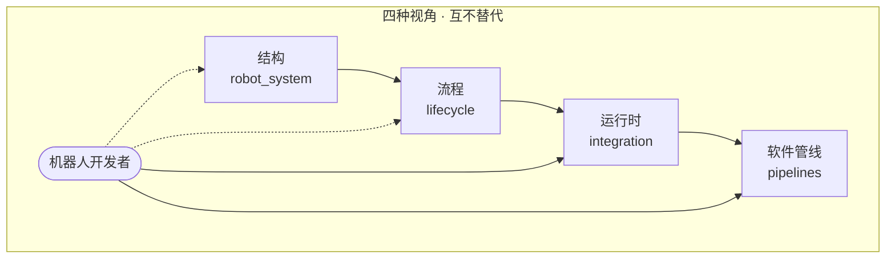
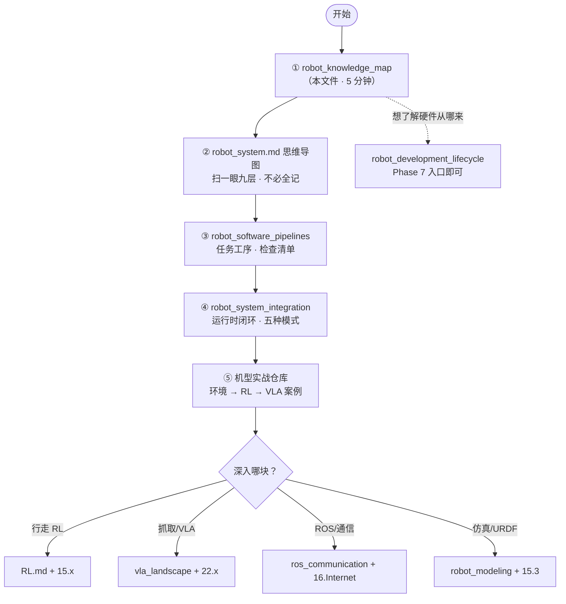
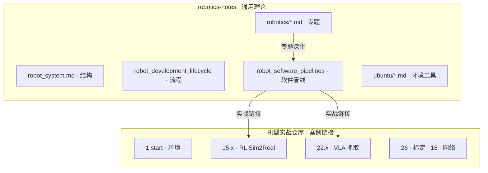

# 机器人知识体系导航图 (Knowledge Map)

> **本文件回答**：这么多文档和图，**各自是什么视角、先看哪个、还缺什么**。
>
> 👉 结构：[robot_system.md](./robot_system.md) · 流程：[robot_development_lifecycle.md](./robot_development_lifecycle.md) · 运行时：[robot_system_integration.md](./robotics/robot_system_integration.md) · 软件管线：[robot_software_pipelines.md](./robotics/robot_software_pipelines.md) · 实战：[kuavo-dev-notes](https://github.com/651yyds3939/kuavo-dev-notes)

---

## 第 0 章：四种视角（一张表搞懂）

| 视角 | 回答的问题 | 主文档 | 图形类型 | 建议权重 |
|------|-----------|--------|---------|---------|
| **结构** | 机器人由什么组成？ | [`robot_system.md`](./robot_system.md) | Markmap 思维导图 | 建立地图 |
| **流程** | 从零怎么造出来？ | [`robot_development_lifecycle.md`](./robot_development_lifecycle.md) | Mermaid 竖向流程图 | 了解即可 |
| **运行时** | 造好后数据/控制怎么流？ | [`robot_system_integration.md`](./robotics/robot_system_integration.md) | 架构图 + 表格 | **常看** |
| **软件管线** | 二次开发具体走哪几条线？ | [`robot_software_pipelines.md`](./robotics/robot_software_pipelines.md) | Mermaid 管线图 | **主场** |

---

## 第 1 章：已有 vs 曾缺 vs 已补

| 图/文档 | 状态 | 说明 |
|--------|------|------|
| 全链路思维导图 | ✅ 已有 | 九层模块，Markmap 展开 |
| 研发全流程大图 | ✅ 已有 | Phase 0–7，含二次开发入口 |
| 系统集成 ASCII 架构 | ✅ 已有 | 双机、多速率 |
| VLA / VFM 专题流程图 | ✅ 已有 | 算法研究向 |
| **知识体系导航** | 🆕 本文件 | 说明「看哪个图」 |
| **软件管线图集** | 🆕 pipelines | Sim2Real、抓取、VLA、TF、学习路径 |
| **双机架构 Mermaid** | 🆕 补在 integration + pipelines | 比 ASCII 更易读 |
| 硬件工具链详图 | ⚪ 浅覆盖 | lifecycle 第 2–3 章表格；非二次开发主场 |
| 岗位/角色矩阵 | ✅ lifecycle 第 7 章 | |
| 两仓库文件导航 | 🆕 本章 3 + pipelines | |

---

## 第 2 章：二次开发者推荐阅读路径

> 买现成平台（如采购双足人形）做算法/应用 —— **跳过 lifecycle Phase 0–4A**，从软件管线入手。

---

## 第 3 章：两仓库分工导航

| 需求 | 去哪个仓库 | 入口 |
|------|-----------|------|
| 概念/架构/工具链 | robotics-notes | 本导航 → 思维导图 |
| 终端命令/魔改/真机 | kuavo-dev-notes | [1.start](https://github.com/651yyds3939/kuavo-dev-notes/blob/master/kuavo_notes/1.start.md) |
| 算法管线怎么串 | robotics-notes | [robot_software_pipelines](./robotics/robot_software_pipelines.md) |
| 断连/摔机/TF 飞 | 两库对照 | [integration](./robotics/robot_system_integration.md) + kuavo rosbag 排障 |

---

## 第 4 章：专题笔记索引（按二次开发场景）

| 场景 | 管线图章节 | 专题笔记 | kuavo 实战 |
|------|-----------|---------|-----------|
| RL 行走 Sim2Real | pipelines § Sim2Real | [RL.md](./robotics/RL.md) | [15.x](https://github.com/651yyds3939/kuavo-dev-notes/tree/master/kuavo_notes) |
| 视觉抓取 | pipelines § Grasp | [dynamics_control](./robotics/dynamics_control.md) | [4.4 / 28](https://github.com/651yyds3939/kuavo-dev-notes/blob/master/kuavo_notes/4.4real_visual_grasp.md) |
| VLA 语音抓取 | pipelines § VLA | [vla_landscape](./robotics/vla_landscape.md) | [22.x](https://github.com/651yyds3939/kuavo-dev-notes/blob/master/kuavo_notes/22.1VLA_grasping.md) |
| 大模型规划 | pipelines § LLM | [llm_for_robotics](./robotics/llm_for_robotics.md) | [21.x / 22.3 MCP](https://github.com/651yyds3939/kuavo-dev-notes/blob/master/kuavo_notes/22.3.MCP_VLA_grasp.md) |
| 数据采集 | pipelines § Data | [benchmark_dataset](./robotics/benchmark_dataset.md) | [22.4 LeRobot](https://github.com/651yyds3939/kuavo-dev-notes/blob/master/kuavo_notes/22.4.Lerobot_grasp.md) |
| Docker/环境 | — | [docker](./robotics/docker.md) · [environment](./robotics/environment.md) | [1.start](https://github.com/651yyds3939/kuavo-dev-notes/blob/master/kuavo_notes/1.start.md) |

---

> **备注**：硬件「了解即可」——详见 lifecycle Phase 2–4 与思维导图第五层；软件二次开发以 **pipelines + integration + kuavo 实战** 为主战场。
