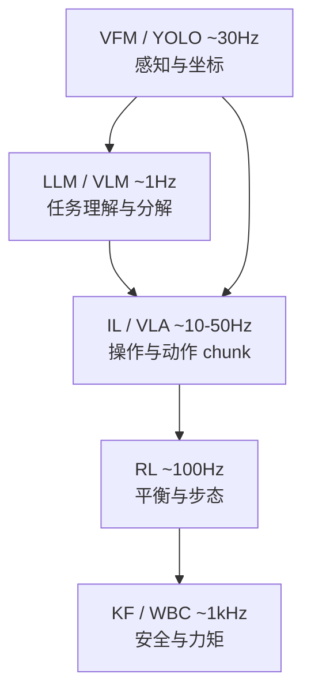

# AI 与机器人学习 —— 算法入口 Hub

> **本文件定位**：机器人 AI 算法栈的**总览入口**。下面一张表讲清五种 AI 范式在机器人上的区别和协作关系。想深入某一方向，从这里跳出去。

## 🤖 AI 子专题导航

| 方向 | 专题笔记 | 实战案例 |
|------|---------|---------|
| **强化学习** | [RL.md](./RL.md) | [行走 RL](https://github.com/651yyds3939/kuavo-dev-notes/blob/master/kuavo_notes/15.4RL_lab_sim_to_real.md) · [舞蹈 IL+RL](https://github.com/651yyds3939/kuavo-dev-notes/blob/master/kuavo_notes/23.1.RL_dance_overview.md) |
| **世界模型** | [world_model.md](./world_model.md) | [TD-MPC2 训练](https://github.com/651yyds3939/kuavo-dev-notes/blob/master/kuavo_notes/31.1.world_model.md) |
| **VLA 具身交互** | [vla_landscape.md](./vla_landscape.md) | [VLA 语音抓取](https://github.com/651yyds3939/kuavo-dev-notes/blob/master/kuavo_notes/22.1VLA_grasping.md) · [MCP Tool Call](https://github.com/651yyds3939/kuavo-dev-notes/blob/master/kuavo_notes/22.3.MCP_LeRobot_VLA_grasp.md) |
| **LLM 机器人规划** | [llm_for_robotics.md](./llm_for_robotics.md) | [Gemini 全双工](https://github.com/651yyds3939/kuavo-dev-notes/blob/master/kuavo_notes/21.3.gemini_model.md) · [行为树 VLA](https://github.com/651yyds3939/kuavo-dev-notes/blob/master/kuavo_notes/22.2.tree_VLA_grasp.md) |
| **视觉基础模型** | [vision_foundation_models.md](./vision_foundation_models.md) | [YOLO 真机](https://github.com/651yyds3939/kuavo-dev-notes/blob/master/kuavo_notes/4.3.real_robot_yolo_environment.md) · [VLM 图像触发](https://github.com/651yyds3939/kuavo-dev-notes/blob/master/kuavo_notes/30.AI_image_identification.md) |
| **模仿学习** | [benchmark_dataset.md](./benchmark_dataset.md) | [LeRobot 数据采集](https://github.com/651yyds3939/kuavo-dev-notes/blob/master/kuavo_notes/22.4.Lerobot_grasp.md) |
| **模型边缘部署** | [edge_deployment.md](./edge_deployment.md) | [Sim2Real ONNX](https://github.com/651yyds3939/kuavo-dev-notes/blob/master/kuavo_notes/15.4RL_lab_sim_to_real.md) |
| **语音管线** | [speech_pipeline.md](./speech_pipeline.md) | [语音大模型](https://github.com/651yyds3939/kuavo-dev-notes/blob/master/kuavo_notes/21.2.local_AI_large_model.md) |
| **通用索引** | → [robot_system.md](../robot_system.md) | → [kuavo-dev-notes](https://github.com/651yyds3939/kuavo-dev-notes) |

---

> 👉 **实战案例**：[21.2 语音大模型](https://github.com/651yyds3939/kuavo-dev-notes/blob/master/kuavo_notes/21.2.local_AI_large_model.md) · [22.x VLA 抓取](https://github.com/651yyds3939/kuavo-dev-notes/blob/master/kuavo_notes/22.1VLA_grasping.md) · [30 图像识别](https://github.com/651yyds3939/kuavo-dev-notes/blob/master/kuavo_notes/30.AI_image_identification.md) · [通用专题索引](https://github.com/651yyds3939/robotics-notes/blob/master/robot_system.md)

### 🤖 机器人全链路 AI 算法拓扑与工程对比图谱

| 算法范式 | 🧬 理论本质与包含关系 | 📊 训练数据与机制 | 🤖 在机器人系统中的【绝对核心应用】 | ⚙️ 机器人工程落地痛点与局限 | 典型机器人开发栈 / 算法框架 |
| :--- | :--- | :--- | :--- | :--- | :--- |
| **传统机器学习 (Traditional ML)** | **【AI 的母集】** 所有现代 AI 的理论地基。基于统计学和概率论。 | **需人工设计特征**。处理结构化数值矩阵、时序一维数据。 | **【底层状态估计与系统诊断】** 1. **系统辨识**：用回归算法推算机器人连杆的真实质量和关节摩擦力系数。 2. **状态估计**：用[卡尔曼滤波](./state_estimation.md) (基于隐马尔可夫模型) 融合 IMU 与里程计数据，算出机器人平滑位姿。 3. **异常诊断**：用支持向量机 (SVM) 监控电机电流波形，防烧毁。 | 无法直接处理摄像头传来的千万像素级画面。极其依赖工程师手动提取数据的数学特征。 | 卡尔曼滤波 (KF) 支持向量机 (SVM) 最小二乘法参数辨识 |
| **深度学习 (Deep Learning - DL)** 👉 [边缘模型部署](./edge_deployment.md)| **【ML 的子集】** 现代机器视觉和 LLM/RL/IL 的公共底层基石。由多层神经网络构成。 | **海量标签数据**。直接吞噬非结构化数据（图像像素、激光点云、声波），**自动**提取特征。 | **【环境感知与高维感官系统】** 1. **视觉障碍物检测**：运行于上位机（如 Nvidia Orin），用 YOLO 实时框出台阶、人群。 2. **3D 场景表征**：用 PointNet 处理激光雷达点云，构建机器人可通行区域的三维栅格地图。 3. **特征降维**：将复杂的图像压缩成几十维的向量，喂给下位机的 [RL](./RL.md) 网络。 | **“看得见，但不知道怎么动”**。纯 DL 只能输出边界框或分类标签，没有物理控制逻辑，不能直接连电机。 | PyTorch / TensorRT YOLO (目标检测) PointNet (点云处理) NeRF (三维重建) |
| **强化学习 (Reinforcement Learning - RL)** 👉 [RL 笔记](./RL.md) | **【独立范式，常与 DL 结合构成 DRL】** 借用 DL 的网络作为大脑，加上试错奖励机制。 | **无需静态数据集**。在物理引擎中通过千万级步数的动态交互（试错）产生经验数据。 | **【运动本能与底盘小脑层 (Locomotion)】** 1. **盲走策略 (Blind Locomotion)**：不需要视觉，全靠 IMU 和关节反馈，在石子路、冰面上输出抗干扰的期望关节力矩。 2. **替代经典控制**：在复杂地形上取代 [MPC + WBC](./dynamics_control.md)，直接生成超越人类手写规则的动态平衡步态。 3. **被动恢复**：被人类踹一脚后，瞬间计算出跨步缓冲的保底动作。 | **Sim-to-Real（虚实鸿沟）是噩梦**。在仿真里练得飞起，实机一跑就劈叉。极度依赖“域随机化”技术来弥补物理引擎与真实世界的误差。 | Isaac Gym / MuJoCo PPO (近端策略优化) SAC算法 |
| **模仿学习 (Imitation Learning - IL)** | **【ML 的交叉领域，常基于 DL 实现】** 本质是用监督学习的方式“抄作业”，有时作为 RL 的前置加速器。 | **极其依赖人类专家数据**。需要动捕设备或遥操作杆，录制人类的“完美通关录像”（视觉输入+动作输出）。 | **【灵巧操作与上肢执行器 (Manipulation)】** 1. **柔性物体操作**：抓衣服、系鞋带、炒菜。物理仿真无法模拟布料的形变，导致 RL 失效，只能靠 IL 让机器人“死记硬背”人类的动作映射。 2. **师生蒸馏策略**：把仿真里全知视角“老师”的步态，拷贝给只看深度摄像头的“盲人学生”。 | **泛化能力极差（遇到没见过的场景就发呆）**。如果机器人倒水时杯子被碰歪了 5 厘米（超出人类演示过的数据分布），网络就会崩溃报错。 | ALOHA (斯坦福遥操作平台) ACT (Action Chunking) 行为克隆 (Behavior Cloning) |
| **大模型 (Large Models - LLMs/VLMs)** | **【DL 的极致演进 (Scale Law)】** 参数量过百亿的超大神经网络，在互联网全量数据上预训练。 | **全网图文数据**。经过预训练 + 人类反馈对齐 (RLHF)，产生了“涌现能力”。 | **【上位机大脑皮层与任务指挥官】** 1. **零代码任务拆解**：人类说“我渴了”，大模型将其翻译为机器人的状态机流：`[寻找杯子] -> [导航至饮水机] -> [抓取接水]`。 2. **视觉常识推理**：看到地上的玻璃渣，推理出“不能踩过去，需要绕行或打扫”。 3. **直接生成代码**：根据场景现场生成控制机械臂的 Python 脚本。 | **不懂物理定律，控制频率极低（<1Hz）**。可能产生幻觉；若直接输出电机转速，可能给出导致硬件损坏的数值。 | GPT-4o / Claude 3.5 Google RT-2 [ROS Agent 框架](./ros_logic.md) |

---

### 🧠 模块关系：它们在人形机器人中是如何“套娃”和协作的？

在最顶尖的人形机器人（如 Figure 01, Tesla Optimus）的架构中，这五种技术绝不是单打独斗的，它们形成了一条从“语义”到“电流”的**降维打击链条**：

1. **大模型 (LLM/VLM) 住在云端或顶级上位机中**。它用 **深度学习 (DL)** 构建的视觉网络看了一眼世界，听懂了人的指令，然后下达了一个宏观目标：“去抓桌子上的苹果”。（频率：1 Hz）
2. **深度学习 (DL)** 在本地上位机疯狂运转，处理深度相机的点云，实时输出苹果的 3D 坐标和避障地图。（频率：30 Hz）
3. **模仿学习 (IL)** 驻扎在机械臂控制器里。它接收到了苹果的坐标，回想起了人类曾抓着它的手演示过的 1000 次抓苹果录像，随即生成了一段丝滑的手臂和五指关节运动轨迹。（频率：50 Hz）
4. **[强化学习 (RL)](./RL.md)** 是守护底盘平衡的小脑。它根本不管苹果在哪，它只知道机械臂伸出去 50 厘米会导致整个机器人重心前移。它立刻调动全身的肌肉，计算出双脚需要往后踩多大的力才能不摔倒。（频率：100 Hz）
5. **传统机器学习 (ML) 与经典控制** 作为最底层的安全锁。[卡尔曼滤波](./state_estimation.md) 在疯狂清洗 IMU 的噪声，[WBC (全身控制)](./dynamics_control.md) 在检查 [RL](./RL.md) 给出的力矩有没有超出电机的极限，最后转化为精准的电流信号。（频率：1000+ Hz）

**文档定位：** 
此前涉及的 `simStepControl.py` 落足点规划，属于**经典控制（无 AI）**。
Isaac Gym 用于，是在训练 **[RL（强化学习小脑）](./RL.md)**。👉 仿真与建模见 [机器人建模](./robot_modeling.md)
若需人形平台执行取件类任务，通常需结合 **DL（感知）** 与 **IL/Manipulation（操作）**。

---

## 协作拓扑：从语义到电流

| 频率带 | 典型模块 | 输出 |
|--------|----------|------|
| ~1 Hz | LLM、行为树顶层 | 子任务 / Tool Call |
| 10–50 Hz | VLA、MoveIt、IL | 轨迹 / action chunk |
| 100 Hz | RL 策略 | 关节目标 / 落足点 |
| 1 kHz+ | WBC、PID、EtherCAT | 力矩 / 电流 |

---

## 快速选型

| 你想解决… | 先看 |
|-----------|------|
| 走路不稳 | [RL.md](./RL.md) · [dynamics_control](./dynamics_control.md) |
| 抓不到物体 | [moveit_manipulation](./moveit_manipulation.md) · [vla_landscape](./vla_landscape.md) |
| 听不懂人话 | [llm_for_robotics](./llm_for_robotics.md) · [speech_pipeline](./speech_pipeline.md) |
| 开放世界检测 | [vision_foundation_models](./vision_foundation_models.md) |
| 模型太慢 | [edge_deployment](./edge_deployment.md) |
