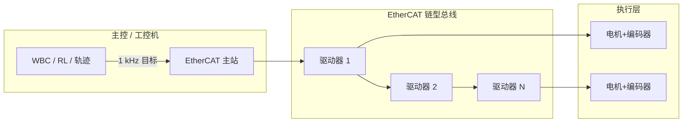

# 现场总线与 EtherCAT —— 人形/多关节实时通信

> **核心定位**：当关节数超过十几个、控制频率到千赫兹级，**CAN 总线带宽和抖动**往往不够。EtherCAT 是目前工业机器人和高端人形平台的主流选择——微秒级同步、链型拓扑、主站周期调度全部关节。
>
> 👉 相关：[电机 FOC](./motor_foc.md) · [PID 控制](./pid_control.md) · [系统集成](./robot_system_integration.md) · [软件管线 · 下位机](./robot_software_pipelines.md)
>
> 👉 实战：[下位机 EtherCAT 启动](https://github.com/651yyds3939/kuavo-dev-notes/blob/master/kuavo_notes/2.1lower_computer.md) · [电机调试](https://github.com/651yyds3939/kuavo-dev-notes/blob/master/kuavo_notes/2.2motor_debug.md)

---

## 第 0 章：一句话

> **大白话**：EtherCAT 像一条**高速传送带**——主站每个周期把全部关节的指令打包发出去，从站（驱动器）在同一时刻收到、同一时刻执行。

---

## 第 1 章：为什么人形需要 EtherCAT



| 总线 | 典型带宽 | 同步精度 | 适用 |
|------|----------|----------|------|
| **CAN / CAN-FD** | 中 | ms 级 | ≤12 关节、机械臂 |
| **EtherCAT** | 高 | μs 级 | 全身 20–40+ 关节 |
| **PROFINET / EtherNet/IP** | 高 | ms 级 | 工业臂、PLC 场景 |

---

## 第 2 章：EtherCAT 工作原理

### 2.1 链型拓扑与「飞读」

EtherCAT 帧经过每个从站时**硬件转发**——从站在帧经过的瞬间读写属于自己的那一段数据，主站无需逐个轮询。因此增加从站几乎不增加通信延迟。

### 2.2 分布式时钟 (DC)

所有从站对齐到同一**分布式时钟**，保证各关节力矩在同一物理时刻生效——对双足/人形**相位一致性**至关重要。

### 2.3 一个控制周期

```text
T=0:     主站发送 PDO（目标位置/力矩/增益）
T=+τ:    从站采样编码器、电流，回传 TPDO
T=+2τ:   主站收到反馈，PID/RL 计算下一帧
```

典型周期：**500 Hz – 2 kHz**（取决于主站 CPU 与从站数量）。

---

## 第 3 章：主站软件栈（Linux）

| 组件 | 作用 |
|------|------|
| **IgH EtherCAT Master** | 开源主站，需专用网卡或实时补丁 |
| **SOEM** | 轻量主站库，嵌入式常用 |
| **TwinCAT / Acontis** | 商业主站，Windows/RT-Linux |
| **PREEMPT_RT / Xenomai** | Linux 实时内核补丁 |

> **权限**：EtherCAT 主站通常需要 `root` 或 `CAP_NET_RAW`，独占网口，不能与常规 TCP/IP 混用。

---

## 第 4 章：PDO / SDO 与对象字典

- **PDO (Process Data Object)**：周期交换的实时数据——目标力矩、位置、速度、状态字
- **SDO (Service Data Object)**：非周期配置——电机参数、限位、故障复位
- **对象字典 (CoE)**：每个从站的标准寄存器表，厂商扩展在 0x6000+ 区域

---

## 第 5 章：工程排障

| 现象 | 常见原因 |
|------|----------|
| 主站 init 失败 | 网口被 NetworkManager 占用 |
| 个别从站 offline | 线缆/接头、从站顺序与 ENI 不符 |
| 抖动大 | 未开 DC、CPU 频率缩放、非 RT 内核 |
| 关节不同步 | PDO 映射错误、周期不一致 |
| 急停后无法恢复 | 驱动器 fault 位未清，需 SDO 复位 |

---

## 第 6 章：与 ROS 的衔接

- **ros_control / ros2_control**：`hardware_interface` 插件封装 EtherCAT PDO 读写
- **控制频率分层**：MoveIt/规划 ~10 Hz → 轨迹插值 ~100 Hz → EtherCAT 环 ~1 kHz
- **安全**：急停切断**动力电**而非逻辑电；详见 [安全 SOP](./safety_sop.md)

---

## 关键词速查

| 术语 | 解释 |
|------|------|
| **ENI** | EtherCAT 网络信息文件，描述拓扑与 PDO 映射 |
| **DC** | Distributed Clocks，分布式时钟同步 |
| **CoE** | CANopen over EtherCAT |
| **WKC** | Working Counter，帧完整性校验 |
