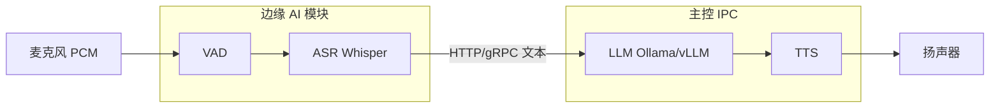

# LLM for Robotics —— 大语言模型在机器人中的应用

> **导读**：在可落地的机器人系统里，大语言模型（LLM）及多模态大模型（VLM）通常担任 **System 2（慢系统）**——理解、分解、编排、对话；**不直接承担高频关节控制**。低层执行仍由经典控制、运动规划、模仿学习或 VLA 策略承担。
>
> 👉 思维导图位置：[2.3.5 LLM for Robotics](../robot_system.md)
>
> 外部索引：[Embodied-AI-Guide · algorithm.md](https://github.com/TianxingChen/Embodied-AI-Guide/blob/main/topics/algorithm.md#llm_robot)
>
> **文档定位**：本文为**机器人通用**笔记——流程图与概念不含具体机型、脚本名、IP；**实战落地**见文末 [Kuavo 案例索引](#实战案例索引-kuavo-dev-notes)。

---

## 第 0 章：一句话理解

```
用户（语音 / 文本 / 视觉事件）
         ↓
    大模型 System 2  (~0.5–2 Hz)
         ↓
  结构化意图 · 对话 · Tool Call · 规划 · 代码
         ↓
  感知 · 行为树 · MCP · MoveIt · IL/VLA  (~10–50 Hz)
         ↓
  经典控制 / IK / WBC / RL  (~100–1000 Hz)
         ↓
    执行器
```

| 对比 | LLM for Robotics | VLA（端到端） | 典型工程分层 |
|------|------------------|---------------|--------------|
| 输出 | 计划 / JSON / tool / 文本 | 动作 token / 连续 action | JSON + 专用感知 + 规划器 |
| 频率 | 低 | 中高 | 混合 |
| 优势 | 可解释、易改逻辑 | 端到端泛化潜力 | 可调试、可兜底 |

**范围说明**：**世界模型（model-based RL）与对话类 LLM 无关**，见 [world_model 专题](./world_model.md)。

---

## 第 1 章：大模型部署技术路线总览

机器人上的「大模型栈」常拆为 **ASR（听）· LLM/VLM（想）· TTS（说）**，再与 **视觉触发**、**工具调用**、**底盘/操作执行** 组合。按 **是否联网** 与 **模块部署位置**，常见路线如下：

| 路线 | 名称 | 联网 | 听 | 想 | 说 | 典型触发 |
|------|------|------|----|----|-----|----------|
| **A** | 本地离线 · 三分离 | ❌ | 边缘 GPU | 主控 LLM 服务 | 主控 TTS | 语音 |
| **B** | 云端 · 全双工端到端 | ✅ | 边缘麦克风 | **云端** 一体化 API | 主控/边缘喇叭 | 语音 |
| **C** | 本地 · 视觉触发 VLM | ❌ 局域网 | — | 主控 VLM | 主控 TTS | 检测到人/物 |
| **D** | 本地 · 语音意图 + 操作 | ❌ 局域网 | 边缘 ASR | LLM 意图解析 | 主控 TTS | 语音 + 视觉 |
| **E** | Agent · Tool Call | 本地/云 | 可选 | LLM + 工具 schema | 可选 | 语音/文本 |
| **F** | 生物特征 / 身份触发 | 本地/云 | — | 认脸后 LLM/VLM | TTS | 人脸识别 |
| **G** | 多模态融合 · 跟随交互 | 通常 ✅ | 边缘 | 云端全双工 + 本地视觉 | TTS + 底盘 | 认脸 + 人体跟踪 |

---

## 第 2 章：通用架构 —— 本地离线「耳 / 脑 / 嘴」三分离（路线 A）

> **适用**：无网展厅、工厂、对延迟和隐私敏感的场景。

### 2.1 设计动机

边缘 AI 模块（常见 **8–16GB 统一内存**）难以同时常驻 7B 级 LLM + ASR + 视觉；主控 IPC（**32–64GB RAM**）更适合跑 Ollama / llama.cpp 等推理服务与 TTS。

### 2.2 通用流程图



### 2.3 能做什么

- 离线问答、讲解、状态播报  
- 作为 **路线 D** 的语音前端（意图 JSON 再下发执行层）

---

## 第 3 章：云端全双工端到端（路线 B）

> **适用**：需要自然对话、打断（barge-in）、低延迟交互；**必须稳定外网 + 代理/专线**。

### 3.1 与路线 A 的差异

| | 路线 A | 路线 B |
|--|--------|--------|
| 链路 | ASR→文本→LLM→文本→TTS（**串行 4 段**） | **WebSocket 音频流端到端**（云内一体化） |
| 大脑位置 | 主控本地 | 云端 API |
| 典型延迟 | 1–3 s | 目标 <1 s 对话感 |

### 3.2 通用流程图

```text
========================================================================================================
          路线 B：云端全双工 · 网关 + 分体发声
========================================================================================================

  [ 麦克风 ] ─────────────────────────────────────────────┐
                                                          v
                      ┌─────────────────────────────────────┐
                      │  边缘 AI 模块：对话网关               │
                      │  · 音频采集 / 预处理 / 降噪           │
                      │  · WebSocket 长连接（需代理/TUN）    │
                      └──────────────┬──────────────────────────┘
                                     │  wss 双向音频+可选图像
                                     v
                      ┌─────────────────────────────────────┐
                      │  云端大模型服务（Live / Realtime API）│
                      │  · 内置 ASR + LLM + TTS 一体化        │
                      └──────────────┬──────────────────────────┘
                                     │  返回音频流（PCM/Base64）
                                     v
                      ┌─────────────────────────────────────┐
                      │  主控：音频中继（UDP/HTTP/ROS）       │
                      │  · 低延迟投送到本体喇叭               │
                      └──────────────┬──────────────────────────┘
                                     v
                              [ 扬声器 ]

  要点：跨机传音频宜用裸 UDP/流式，避免 ROS 大消息序列化延迟
```

---

## 第 4 章：视觉触发 + VLM（路线 C）

> **适用**：从「等用户说话」升级为「主动观察、主动搭话」。

### 4.1 通用流程图

```text
========================================================================================================
          路线 C：视觉扳机 · 检测 → VLM → TTS
========================================================================================================

  [ RGB / RGB-D 相机 ]
         │
         v
  ┌──────────────────┐     布尔/事件触发      ┌──────────────────┐
  │ 轻量检测器        │ ───────────────────> │ VLM 观察者        │
  │ (人形/目标检测)   │                      │ · 订阅最新帧       │
  │ 高帧率 @边缘      │                      │ · 防抖/冷却/互斥   │
  └──────────────────┘                      └─────────┬────────┘
                                                      │ HTTP API
                                                      v
                                            ┌──────────────────┐
                                            │ 主控 VLM 服务     │
                                            │ (多模态 chat)     │
                                            └─────────┬────────┘
                                                      v
                                            ┌──────────────────┐
                                            │ TTS → 扬声器      │
                                            └──────────────────┘

  算力：检测在边缘；VLM 推理低频、放主控；ASR 与 VLM 不宜同机满载
```

### 4.2 能做什么

- 迎宾、访客描述、展品讲解  
- 视觉问答（「你看到了什么？」）

---

## 第 5 章：语音意图 + 操作执行（路线 D · 工程 VLA 分层）

> **适用**：「说一句话 → 机器人动手」；大模型**不输出关节角**，只输出 **结构化意图**，坐标与轨迹由感知+规划层完成。

### 5.1 通用流程图

```text
========================================================================================================
          路线 D：语音/语义 System 2 + 视觉/规划 System 1
========================================================================================================

  语音 ──> [ 边缘 ] ASR ──> LLM 意图解析 ──> { action, target, params }
                                                    │
  相机 ──> [ 边缘 ] 目标检测 + 深度/TF ──────────────┤
                                                    v
                              [ 主控/下位机 ] 任务调度层
                              · 状态机 / 行为树 / 守护进程
                              · IK / MoveIt / 轨迹插值
                                                    v
                              [ 实时层 ] WBC / 伺服 / 夹爪
                                                    v
                                         机械臂 / 底盘 / 末端

  关键：3D 目标位姿来自感知链，非 LLM 幻觉坐标
```

### 5.2 System 2 编排的三种工程形态

| 形态 | 机制 | 特点 |
|------|------|------|
| **状态机** | LLM → JSON → 硬编码分支 | 简单、易排错 |
| **行为树** | LLM → 黑板/话题 → py_trees 节点 | 可组合、可扩展 |
| **MCP / Tool** | LLM 逐步调用 register 工具 | 灵活、Agent 化（见路线 E） |

---

## 第 6 章：Agent · Tool Call（路线 E）

### 6.1 通用流程图

```text
========================================================================================================
          路线 E：LLM Agent + 工具 HTTP/ROS 桥
========================================================================================================

  用户指令
       │
       v
  ┌────────────────────────────────────────┐
  │  LLM（带 Tool Schema / Function Call）   │
  │  推理：选工具 → 填参数 → 读返回值 → 再推理 │
  └────────────────┬───────────────────────┘
                   │  HTTP POST / ROS Service / Action
                   v
  ┌────────────────────────────────────────┐
  │  工具层（原子能力注册表）                 │
  │  · locate_target   · plan_trajectory    │
  │  · execute_motion  · speak / telemetry  │
  └────────────────┬───────────────────────┘
                   v
  已验证的运动/抓取/感知模块（勿重复实现底层逻辑）

  与路线 D 关系：行为树 = 固定剧本；Agent = 模型自主选步骤与容错
```

---

## 第 7 章：身份触发与多模态融合（路线 F / G）

### 7.1 路线 F：人脸识别触发对话

```text
  相机 → 人脸检测/特征提取 → 与本地特征库比对 → 身份确认（FSM 防抖）
       → LLM/VLM 生成个性化问候 → TTS
  本地版：主控 LLM；云端版：认脸后 UDP/HTTP 投图+Prompt 至全双工网关
```

### 7.2 路线 G：认脸 + 视觉跟随 + 云端对话（三进程隔离）

```text
========================================================================================================
          路线 G：视觉跟随 + 身份认知 + 云端对话（进程隔离）
========================================================================================================

  进程 1 [边缘 · 禁止网络代理劫持]
    · 主线程：人体检测 → 底盘速度指令（需使能开关 + 行走状态前置）
    · 后台线程：人脸识别（降频、CPU、ROI 裁剪）

  进程 2 [边缘 · 可走代理]
    · 全双工云端 API 网关
    · 接收进程 1 的本地 UDP/共享内存 视觉事件

  进程 3 [主控]
    · WBC / 底盘 / TTS

  隔离原因：代理库与 OpenCV/ONNX 等同进程易段错误；双视觉模型易 OOM
```

---

## 第 8 章：除上述路线外，还有哪些实现方式？

| 方式 | 简述 | 与 A–G 关系 |
|------|------|-------------|
| **LLM + 符号规划** | LLM 生成 PDDL/子目标 → MoveIt/OMPL | D 的学术版（LLM+P） |
| **Code as Policy** | LLM 生成 Python 调 API | E 的单次脚本版 |
| **3D 接地（VoxPoser 类）** | VLM 在 3D 场生成约束再采样轨迹 | 替代 bbox+IK |
| **纯 VLA 端到端** | 单模型 图+文→action | 见 [VLA 研究版图](./vla_landscape.md) |
| **RAG 知识库** | 手册/日志进向量库，LLM 检索回答 | 运维排障，非实时控制 |
| **混合云脑** | 本地 ASR + 云端 LLM + 本地 TTS | A 与 B 折中 |
| **LLM 安全审查** | 规划结果经 LLM 检查后再执行 | System 2 仅 veto |
| **数据侧 LLM** | 自动标注轨迹、生成任务语言 | 训练流水线，非机载实时 |
| **多机协同** | 中央 LLM 分配子任务 | 仓储/多臂场景 |

### 8.1 「耳 / 脑 / 嘴」其它组合

| 组合 | 场景 |
|------|------|
| 耳+脑云端，嘴本地 | 弱边缘算力 |
| 全边缘小模型（≤3B） | 轮式/轻量平台 demo |
| 无嘴（屏幕/APP 文字） | 嘈杂环境、调试 |
| 无耳（文本/chat 指令） | 自动化测试、MCP 脚本 |

---

## 第 9 章：部署大模型还能干什么？（能力地图）

### 9.1 交互与 HRI

| 能力 | 说明 |
|------|------|
| 多轮对话、打断 | 云端全双工（B）或本地链（A） |
| 主动搭话 | 视觉/VLM 触发（C） |
| 身份个性化 | 生物特征触发（F） |
| 移动陪伴 | 跟随 + 对话（G） |
| 长期记忆 / 多用户 | 需外存 profile（通用扩展） |

### 9.2 任务理解与编排

| 能力 | 说明 |
|------|------|
| 意图分类 | grab / chat / nav / stop |
| 长程分解 | 「收拾桌面」→ 多步子任务 |
| 模糊消歧 | 多轮追问 + 视觉指代 |
| Tool 编排 | 检测 → 规划 → 执行 → 播报（E） |

### 9.3 感知与语义（常配合 VLM，非 LLM 独占）

| 能力 | 说明 |
|------|------|
| 场景描述 / 问答 | VLM |
| 开放词表检测 | 见 [VFM 专题](./vision_foundation_models.md) |
| 异常/日志解读 | RAG + LLM |

### 9.4 明确不应单独交给 LLM 的

- 高频力矩 / WBC  
- 精确 6D 抓取位姿（应用感知+几何）  
- 硬实时急停与安全联锁  
- 未经校验的直接关节角输出  

---

## 第 10 章：算力分工原则（通用）

```text
┌─────────────────────────────────────────────────────────────┐
│  边缘 AI 模块（近传感器，内存紧）                             │
│  ✅ ASR · 轻量检测 · 相机驱动 · 对话网关（无大模型权重）       │
│  ⚠️ 慎载 7B+ LLM（统一内存易 OOM）                            │
├─────────────────────────────────────────────────────────────┤
│  主控 IPC（大内存，近执行器）                                 │
│  ✅ LLM/VLM 服务 · TTS · MCP/行为树 · IK/MoveIt 调度          │
│  ✅ 实时运动控制（或独立实时核）                              │
└─────────────────────────────────────────────────────────────┘
```

---

## 第 11 章：路线选型（通用决策）

```text
需要联网？
  ├─ 否 → 要动手吗？
  │        ├─ 是 → D（意图+规划）或 E（Agent）
  │        └─ 否 → A（纯对话）或 C/F（视觉/认脸触发）
  └─ 是 → 要全双工自然对话？
           ├─ 是 → B 或 G（+跟随）
           └─ 否 → 混合云 LLM + 本地 ASR/TTS

要开放词表/长任务 Agent → 优先 E
要认熟人 → F
要跟着人走并聊天 → G
```

---

## 第 12 章：研究侧范式（扩展阅读）

| 范式 | 代表 | 链接 |
|------|------|------|
| 高层规划 | PaLM-E, LLM+P | [PaLM-E](https://arxiv.org/abs/2303.03378) |
| 3D+LLM | VoxPoser | [arXiv](https://arxiv.org/abs/2307.05973) |
| Code as Policy | CaP | [arXiv](https://arxiv.org/abs/2209.07753) |
| Agent 综述 | Lilian Weng | [博客](https://lilianweng.github.io/posts/2023-06-23-agent/) |
| 决策链评测 | Embodied Agent Interface | [官网](https://embodied-agent-interface.github.io/) |

Embodied-AI-Guide 结论：**LLM 做 System 2 + IL/VLA/经典控制做 System 1**，是当前最可控组合。

---

## 第 13 章：常见误区

| 误区 | 正解 |
|------|------|
| 「部署大模型 = 部署 VLA 论文模型」 | 多数是 **LLM 意图 + 经典执行栈** |
| 「LLM 可以直接给抓取坐标」 | 坐标应来自 **感知+标定+几何** |
| 「边缘板卡能随便跑 7B」 | 需看统一内存与 OOM；大模型常放主控 |
| 「代理与视觉推理可同进程」 | 代理劫持易与 C++ 视觉库冲突，宜**进程隔离** |
| 「ASR 与 VLM 可同时满载」 | 需分时或分机，监控内存水位 |

---

## 第 14 章：相关专题

- [VLA 研究版图](./vla_landscape.md) — 端到端 VLA 与工程分层对照  
- [视觉基础模型](./vision_foundation_models.md) — 检测/分割与 YOLO 选型  
- [Benchmark 与 Dataset](./benchmark_dataset.md)  
- [ROS 架构逻辑 / 行为树](./ros_logic.md)  
- [AI 与机器人学习拓扑](./AI_learning_robotics.md)

---

## 实战案例索引（kuavo-dev-notes）

> 以下为 **[kuavo-dev-notes](https://github.com/651yyds3939/kuavo-dev-notes) 机型实战仓库** 中的落地文档，含终端命令、踩坑与源码路径；**通用概念以上文为准**。

| 主题 | 对应路线 | GitHub |
|------|----------|--------|
| 本地离线 Qwen + Whisper + VITS | A | [21.2](https://github.com/651yyds3939/kuavo-dev-notes/blob/master/kuavo_notes/21.2.local_AI_large_model.md) |
| Gemini Live 全双工 | B | [21.3](https://github.com/651yyds3939/kuavo-dev-notes/blob/master/kuavo_notes/21.3.gemini_model.md) |
| YOLO 触发 + VLM 迎宾 | C | [30](https://github.com/651yyds3939/kuavo-dev-notes/blob/master/kuavo_notes/30.AI_image_identification.md) |
| 语音 VLA 抓取（状态机） | D | [22.1](https://github.com/651yyds3939/kuavo-dev-notes/blob/master/kuavo_notes/22.1VLA_grasping.md) |
| 行为树版 VLA | D | [22.2](https://github.com/651yyds3939/kuavo-dev-notes/blob/master/kuavo_notes/22.2.tree_VLA_grasp.md) |
| MCP Tool Call 抓取 | E | [22.3](https://github.com/651yyds3939/kuavo-dev-notes/blob/master/kuavo_notes/22.3.MCP_VLA_grasp.md) |
| LeRobot 数据采集 | — | [22.4](https://github.com/651yyds3939/kuavo-dev-notes/blob/master/kuavo_notes/22.4.Lerobot_grasp.md) |
| 人脸识别触发交互 | F | [32.1](https://github.com/651yyds3939/kuavo-dev-notes/blob/master/kuavo_notes/32.1.face_recognition.md) |
| 认脸+跟随+Gemini | G | [32.2](https://github.com/651yyds3939/kuavo-dev-notes/blob/master/kuavo_notes/32.2.face_recognition_traking.md) |
| VLA 九终端总览（流程图详版） | D | [vla_landscape §4 案例链](./vla_landscape.md) |
