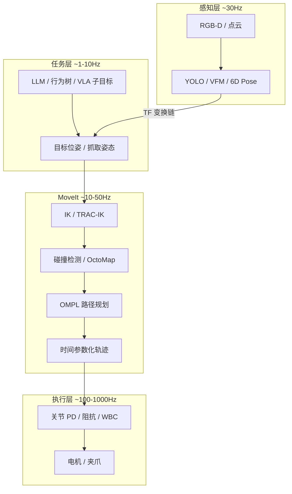

# MoveIt 运动规划与操作 (Manipulation)

> **核心定位**：MoveIt 是 ROS 生态里**机械臂/上半身操作**的标准运动规划框架——负责碰撞检测、逆运动学、轨迹生成与执行，但不负责「看到什么」和「想做什么」。视觉抓取、VLA、LLM 规划最终都要把**末端目标**交给 MoveIt（或等价的 IK + 轨迹模块）。
>
> 👉 相关：[动力学与 IK](./dynamics_control.md) · [TF 树](./tf_tree.md) · [视觉基础模型](./vision_foundation_models.md) · [软件管线 · 抓取](./robot_software_pipelines.md)
>
> 👉 实战：[MoveIt 双轨抓取](https://github.com/651yyds3939/kuavo-dev-notes/blob/master/kuavo_notes/28.moveit_grasping.md) · [IK 逆运动学](https://github.com/651yyds3939/kuavo-dev-notes/blob/master/kuavo_notes/9.IK.md) · [视觉抓取](https://github.com/651yyds3939/kuavo-dev-notes/blob/master/kuavo_notes/6.visual_grasp.md)

---

## 第 0 章：一句话

> **大白话**：感知层给出「抓哪里」，MoveIt 回答「关节怎么动才能到那里、还不撞到自己」。

---

## 第 1 章：MoveIt 在操作栈中的位置

| 模块 | MoveIt 做 | MoveIt 不做 |
|------|-----------|-------------|
| 物体检测 | — | YOLO / Grounding-DINO |
| 坐标变换 | 消费 TF | 标定手眼关系 |
| 路径规划 | ✅ OMPL / CHOMP / Pilz | — |
| 全身平衡 | — | WBC / RL 底盘 |
| 力控抓取 | 部分（笛卡尔约束） | 完整力/阻抗环 |

---

## 第 2 章：核心概念

### 2.1 Planning Scene

MoveIt 维护一个**规划场景**：机器人 URDF/SRDF、已知障碍物（OctoMap 点云、碰撞 object）、附着物体（attached object）。每次规划前必须保证场景与真实世界一致，否则「规划成功、执行撞墙」。

### 2.2 运动规划流水线

1. **目标设定**：`MoveGroup::setPoseTarget()` 或关节空间目标
2. **IK 求解**：TRAC-IK / KDL — 冗余自由度时选「最舒适」解
3. **碰撞检测**：FCL 库，自碰撞 + 环境碰撞
4. **路径搜索**：RRTConnect / RRT* / PRM（OMPL）
5. **轨迹平滑**：时间参数化、速度/加速度限幅
6. **执行**：`moveit_controller_manager` → ros_control / 自定义接口

### 2.3 视觉抓取典型链路

| 步骤 | 模块 | 常见坑 |
|------|------|--------|
| 检测 | YOLO bbox / mask | 类别映射错误 |
| 坐标 | camera → base_link TF | 手眼标定过期 |
| 抓取姿态 | 预抓取 / 接近 / 闭合 | 法向量估计错误 |
| 规划 | MoveIt pick pipeline | OctoMap 未更新 |
| 执行 | 轨迹 action server | 控制器未 ready |

---

## 第 3 章：MoveIt 1 vs MoveIt 2

| | MoveIt 1 (ROS1) | MoveIt 2 (ROS2) |
|--|-----------------|-----------------|
| 生态 | 成熟、资料多 | 新平台首选 |
| 规划 | OMPL 为主 | 同 + MoveIt Servo（实时伺服） |
| 并发 | 单 Master | DDS 多节点 |
| 人形 | 需自定义 whole-body group | 同上，常拆 arm + torso |

> 人形机器人上半身操作常把**臂组**与**躯干/平衡**分开：MoveIt 管臂轨迹，WBC/RL 管重心与步态。

---

## 第 4 章：工程排障清单

- **Planning failed**：目标不可达 / 碰撞 / IK 无解 → 可视化 RViz 中 goal marker
- **Controller failed**：action 名不匹配、关节顺序与 URDF 不一致
- **Executed but missed**：TF 时间戳过期、相机与机械臂不同步
- **Slow planning**：OctoMap 分辨率过细、点云未裁剪 ROI

---

## 关键词速查

| 术语 | 解释 |
|------|------|
| **SRDF** | 语义描述：规划组、禁用碰撞对、虚拟关节 |
| **OMPL** | 开源运动规划库，MoveIt 默认后端 |
| **OctoMap** | 3D 占据栅格，动态避障 |
| **TRAC-IK** | 比 KDL 更鲁棒的 IK 求解器 |
| **MoveGroup** | MoveIt 对外主 API 抽象 |
