# 二次开发软件管线图 (Software Pipelines)

> **核心定位**：二次开发者的**操作手册**——在已有硬件上，从环境搭好到某个 Demo 跑通，**按什么顺序做、每步产出什么、失败回哪一步**。
>
> **与 [robot_system_integration.md](./robot_system_integration.md) 的分工**：
> - **integration** = 运行时数据/控制**怎么闭环、怎么断、五种集成模式**（交通网络原理图）
> - **本篇 pipelines** = 具体任务**工序链、工具链、检查清单、实战链接**（地铁路线图）
>
> 👉 导航：[知识体系地图](../robot_knowledge_map.md) · 运行时闭环：[integration](./robot_system_integration.md) · 结构：[robot_system.md](../robot_system.md) · 实战案例：[kuavo-dev-notes](https://github.com/651yyds3939/kuavo-dev-notes)

---

## 第 0 章：任务选型 — 要做的事走哪条管线

| 目标 | 主读章节 | integration 对应模式 | 典型周期 |
|------|----------|---------------------|----------|
| 环境跑通、第一个节点 | [§2 环境部署](#第-2-章环境部署与最小闭环) | — | 0.5–2 天 |
| 仿真 / 真机 bringup | [§3 Launch](#第-3-章launch-与-bringup-管线) | Ⅰ / Ⅱ | 0.5–1 天 |
| RL 行走 / 舞蹈上真机 | [§4 Sim2Real](#第-4-章sim2real-管线-rl-行走--舞蹈) | Ⅱ + 横切 Sim2Real | 1–4 周 |
| 自主导航 Demo | [§5 导航](#第-5-章导航管线) | Ⅰ | 3–7 天 |
| 视觉抓取 / MoveIt | [§6 视觉抓取](#第-6-章视觉抓取管线) | Ⅲ（+Ⅱ 若双机） | 3–10 天 |
| 语音 / VLA / MCP 任务 | [§7 VLA 分层](#第-7-章vla-分层管线) | Ⅱ + Ⅲ + Ⅴ | 1–3 周 |
| 示教采集 → IL/VLA 训练 | [§8 数据采集](#第-8-章数据采集与-ilvla-训练管线) | Ⅴ | 1–2 周 |
| 模型导出与边缘部署 | [§9 模型部署](#第-9-章模型部署管线) | 横切 | 1–3 天 |
| 标定 / TF 排查 | [§10 标定清单](#第-10-章标定与-tf-落地清单) | Ⅲ | 0.5–2 天 |
| 联调 / 录包 / 回放 | [§11 排障回放](#第-11-章联调排障与-rosbag-回放) | 全部 | 持续 |

**双机拓扑、多速率原则、跨机目标流**不在此重复展开 → [integration §三–§六](./robot_system_integration.md#三五种集成模式模式详图)。

---

## 第 1 章：二次开发软件栈（主要碰哪几层）

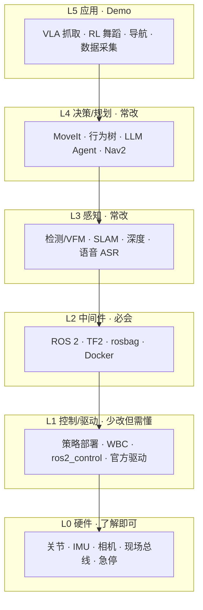

| 层级 | 二次开发典型操作 | 少碰/别乱改 | 本篇相关章节 |
|------|----------------|------------|-------------|
| L5–L3 | 写节点、训模型、调参 | — | §4–§8 |
| L2 | 配 launch、网络、容器、录包 | — | §2–§3、§11 |
| L1 | 部署 ONNX、对齐 obs、切换控制器 | 固件、FOC、WBC 内核 | §4、§9 |
| L0 | 标定、读手册 | PCB、机械装配 | §10 |

### 1.1 双机部署速查（仅列「开发机放哪」，架构原理见 integration）

| 工作类型 | 常见部署位置 | 备注 |
|----------|-------------|------|
| 大模型 / VLA / Docker 推理 | 上位机 GPU | 勿占实时核 |
| 视觉检测 / 深度 | 上位机 | 结果变换后再下发 |
| RL 策略 / WBC / 关节伺服 | 下位机 / 实时核 | 与训练 obs 对齐 |
| 训练 / 数据打包 | 离线 PC | 不接入控制链路 |
| Nav2 / SLAM 建图 | 视平台；常上位或同机 | 见 §5 |

👉 网络与通信：[ros_communication](./ros_communication.md) · 实战：[16.Internet](https://github.com/651yyds3939/kuavo-dev-notes/blob/master/kuavo_notes/16.Internet.md)

---

## 第 2 章：环境部署与最小闭环

**产出**：能在仿真或实机上 `launch` 一个官方栈，并确认至少一个节点在发数据。

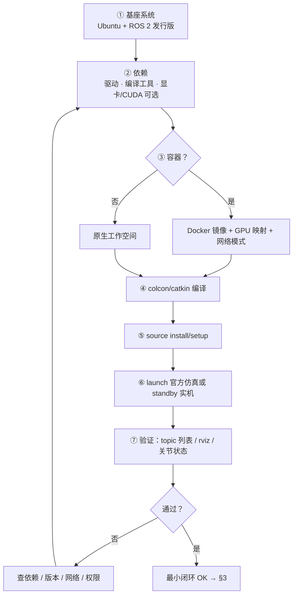

### 2.1 每步检查清单

| 步骤 | 检查项 | 常见失败 |
|------|--------|----------|
| ① 基座 | 发行版与官方要求一致 | 22.04/24.04 混用 |
| ② 依赖 | 驱动、realtime、lib 齐全 | CUDA/TensorRT 版本不匹配 |
| ③ 容器 | `--net=host` 或正确 bridge；GPU `--gpus all` | ROS 发现不到对端 |
| ④ 编译 | 无 red error；package 在 list 里 | 混用 ROS1/2 工作空间 |
| ⑤ source | 每个新终端都 source | 能找到包但 runtime 找不到 so |
| ⑥ launch | 仿真切 `use_sim_time` | 实机误开 sim_time |
| ⑦ 验证 | `topic hz` 有关键流 | 驱动未起、IP 不对 |

👉 [environment](./environment.md) · [docker](./docker.md) · 实战：[1.start](https://github.com/651yyds3939/kuavo-dev-notes/blob/master/kuavo_notes/1.start.md) · [2.first_node](https://github.com/651yyds3939/kuavo-dev-notes/blob/master/kuavo_notes/2.first_node.md)

---

## 第 3 章：Launch 与 bringup 管线

**产出**：明确当前是仿真还是实机，所需节点全部起来，且控制链使能前处于安全姿态。

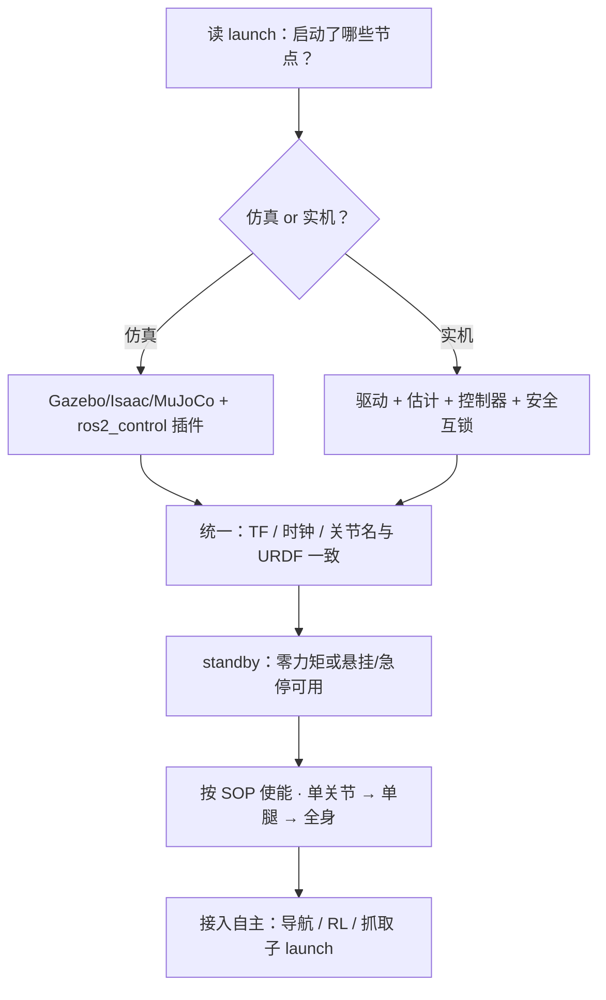

| 阶段 | 动作 | 禁止事项 |
|------|------|----------|
| 启动前 | 急停可用、龙门架/吊挂（双足）、线缆检查 | 直接上电满力矩 |
| 启动后 | 看 joint state、IMU、无 error 刷屏 | 未看日志就切 RL |
| 使能 | 官方顺序：校准 → 站立 → 模式切换 | 跳过标定零点 |
| 叠加自主 | 先开感知/定位，再开规划，最后开执行 | 规划先于定位 |

---

## 第 4 章：Sim2Real 管线（RL 行走 / 舞蹈）

**产出**：训练策略在真机上可重复站立/行走，观测与仿真一致，有回滚 SOP。

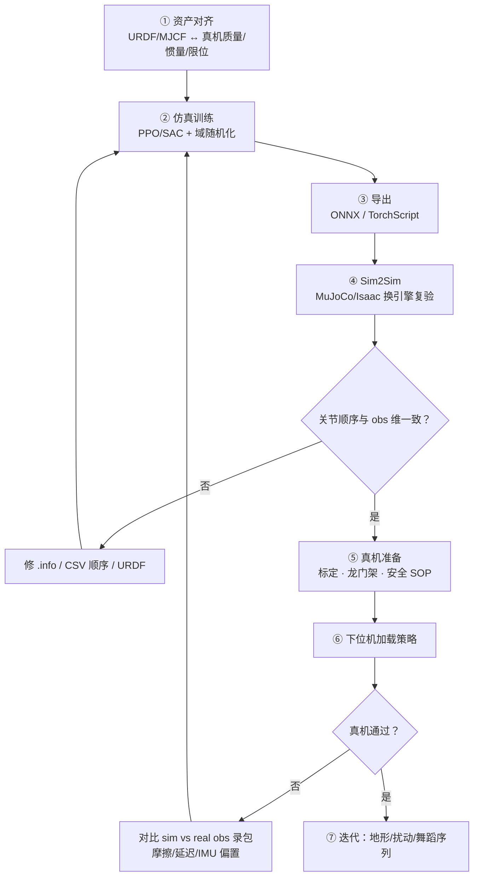

### 4.1 关键产物清单

| 产物 | 用途 | 对齐要点 |
|------|------|----------|
| URDF / MJCF | 仿真与可视化 | 关节名、轴向、限位与真机一致 |
| `.info` / obs 配置 | 策略输入维数 | 顺序错 1 个即失稳 |
| 训练 checkpoint | 继续训 / 导出 | 与导出脚本版本匹配 |
| ONNX | 下位机推理 | opset、输入名、batch=1 |
| 启动 launch | 加载策略 | 频率、话题 remap |
| 安全 SOP 文档 | 真机试机 | 急停、悬挂、回零 |

### 4.2 逐步验收标准

| 阶段 | 通过标准 |
|------|----------|
| Sim2Sim | 换引擎仍走 ≥30s 不摔 |
| 悬挂试机 | 关节响应方向/幅值正确 |
| 触地站立 | 可站 10s 无发散 |
| 慢速行走 | 直线 2m、可停 |
| 舞蹈/复杂 | 序列完整、无模式切换事故 |

👉 [RL](./RL.md) · [robot_modeling](./robot_modeling.md) · [edge_deployment](./edge_deployment.md) · 实战：[15.1](https://github.com/651yyds3939/kuavo-dev-notes/blob/master/kuavo_notes/15.1.RL_lab_train.md) · [15.3](https://github.com/651yyds3939/kuavo-dev-notes/blob/master/kuavo_notes/15.3RL_lab_sim_to_sim.md) · [15.4](https://github.com/651yyds3939/kuavo-dev-notes/blob/master/kuavo_notes/15.4RL_lab_sim_to_real.md)

架构级 Sim2Real 折叠见 [integration §6.3](./robot_system_integration.md#63-仿真折叠与-sim2real)。

---

## 第 5 章：导航管线

**产出**：有地图、能定位、能发速度或路径跟随指令，RViz 中位姿与激光一致。

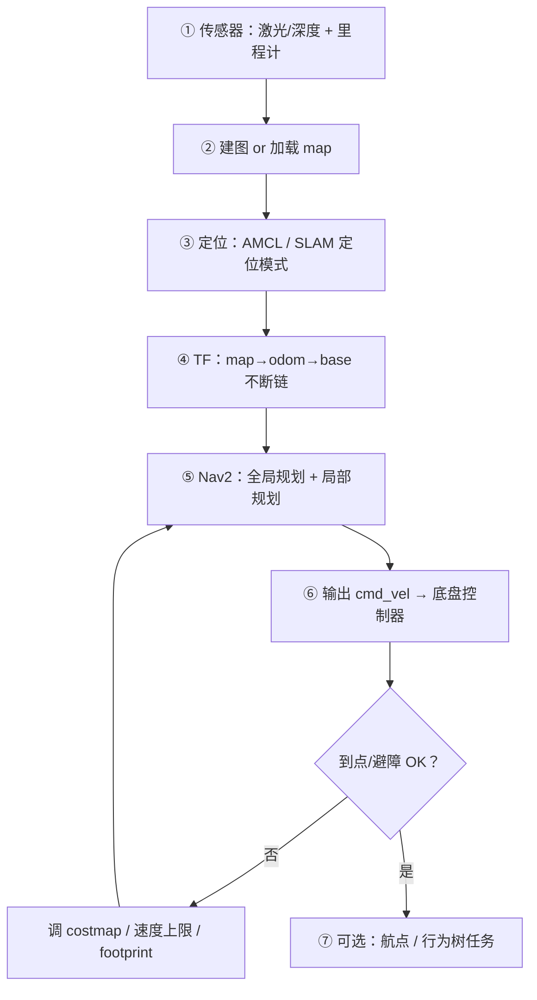

| 步骤 | 工具/模块 | 验收 |
|------|-----------|------|
| 建图 | SLAM Toolbox / Cartographer / 官方栈 | 回环后墙不双影 |
| 定位 | AMCL | 人为挪动 1m 内能拉回 |
| 规划 | Nav2 | 窄道不撞、能绕障 |
| 实机 | 速度平滑、急停 | 急停 0.5s 内停 |

👉 [slam](./slam.md) · [path_planning](./path_planning.md) · [tf_tree](./tf_tree.md) · 实战：[3.map_navigation](https://github.com/651yyds3939/kuavo-dev-notes/blob/master/kuavo_notes/3.map_navigation.md)

integration 中轮式导航**数据流原理**见 [§4.1](./robot_system_integration.md#41-轮式自主导航)。

---

## 第 6 章：视觉抓取管线

**产出**：给定物体类别或位姿，能稳定完成「接近 → 抓取 → 抬起」至少 N 次成功。

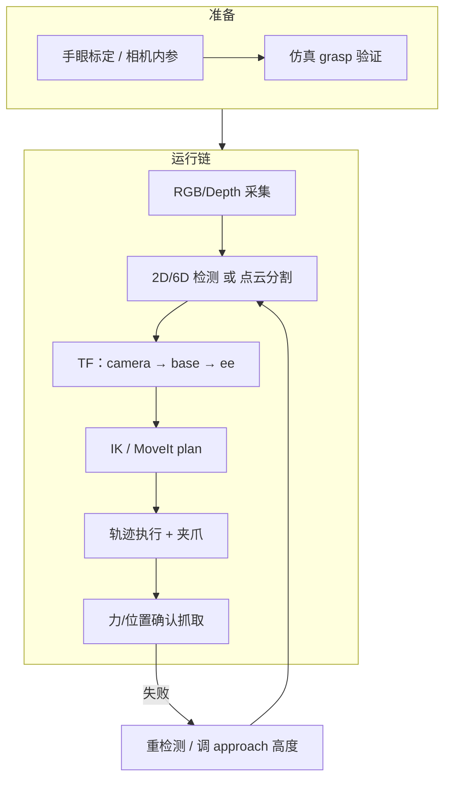

### 6.1 分阶段验收

| 阶段 | 内容 | 通过标准 |
|------|------|----------|
| 标定 | 相机内参 + 手眼 | 戳点误差 < 阈值（如 1cm 级） |
| 仿真 | MoveIt / 碰撞体 | 10 次 grasp 无碰撞 abort |
| 实机空抓 | 不开夹爪走轨迹 | 轨迹平滑、无奇异 |
| 实机抓取 | 固定位置物体 | ≥8/10 成功 |
| 泛化 | 随机摆放 | 按任务要求统计成功率 |

### 6.2 与 integration 的分工

- **坐标变换链、双机目标下发** → [integration 模式Ⅲ / §5.1](./robot_system_integration.md#51-跨机目标流模式ⅱ--ⅲ-合成)
- **MoveIt 配置、检测模型选型、抓取策略** → [MoveIt 专题](./moveit_manipulation.md) · 本篇

👉 专题：[现场总线与 EtherCAT](./fieldbus_and_ethercat.md)（下位机通信）

👉 实战：[6.visual_grasp](https://github.com/651yyds3939/kuavo-dev-notes/blob/master/kuavo_notes/6.visual_grasp.md) · [4.4 真机](https://github.com/651yyds3939/kuavo-dev-notes/blob/master/kuavo_notes/4.4real_visual_grasp.md) · [28 MoveIt](https://github.com/651yyds3939/kuavo-dev-notes/blob/master/kuavo_notes/28.moveit_grasping.md)

---

## 第 7 章：VLA 分层管线

**产出**：语音或文本指令能触发正确的子技能（走、抓、放），慢环不阻塞快环。

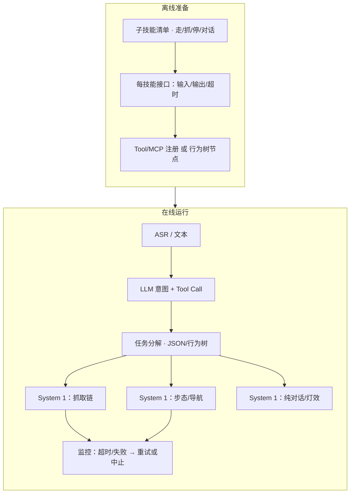

### 7.1 工程要点

| 项 | 建议 |
|----|------|
| 慢环频率 | ~1 Hz；只发**子目标**，不发力矩 |
| 技能边界 | 每个 Tool 单一职责，带超时与取消 |
| 状态机 | 显式 IDLE / EXEC / FAIL，防并发抓+走 |
| 视觉 | 检测与 LLM 解耦；LLM 只选 skill id + 参数 |
| 评测 | 固定指令集回归（如 20 条语音） |

👉 专题：[vla_landscape](./vla_landscape.md) · [llm_for_robotics](./llm_for_robotics.md) · 实战：[22.1 VLA](https://github.com/651yyds3939/kuavo-dev-notes/blob/master/kuavo_notes/22.1VLA_grasping.md) · [22.3 MCP](https://github.com/651yyds3939/kuavo-dev-notes/blob/master/kuavo_notes/22.3.MCP_VLA_grasp.md)

---

## 第 8 章：数据采集与 IL/VLA 训练管线

**产出**：LeRobot / 自定义格式数据集，obs-action 对齐，可复现训练脚本。

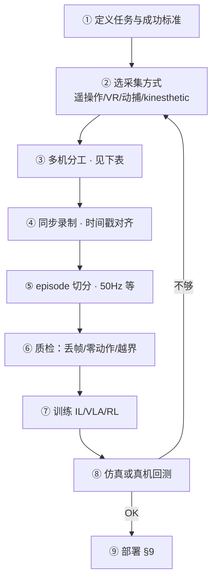

### 8.1 三机分工（常见工程布局）

| 角色 | 职责 | 录制内容 |
|------|------|----------|
| 下位机 / 实时 | 关节状态、IMU、动作 | 高频 state + action |
| 上位机 / 视觉 | 相机 RGB/Depth | 图像流 |
| 离线 PC | 打包、转 LeRobot、训练 | 不介入控制 |

### 8.2 数据集字段（LeRobot v3 思路）

| 字段 | 说明 |
|------|------|
| observation.state | 关节角/速度等，与部署 obs 一致 |
| observation.images.* | 每路相机命名固定 |
| action | 与 state 同频或插值到同频 |
| episode_index | 可复现切分 |
| task | 语言标签（VLA 用） |

👉 [benchmark_dataset](./benchmark_dataset.md) · 实战：[22.4 LeRobot](https://github.com/651yyds3939/kuavo-dev-notes/blob/master/kuavo_notes/22.4.Lerobot_grasp.md)

integration 中遥操作**架构**见 [§4.7 / 模式Ⅴ](./robot_system_integration.md#47-遥操作与示教采集)。

---

## 第 9 章：模型部署管线

**产出**：训练权重可在目标设备上以规定延迟运行，输入输出与训练一致。

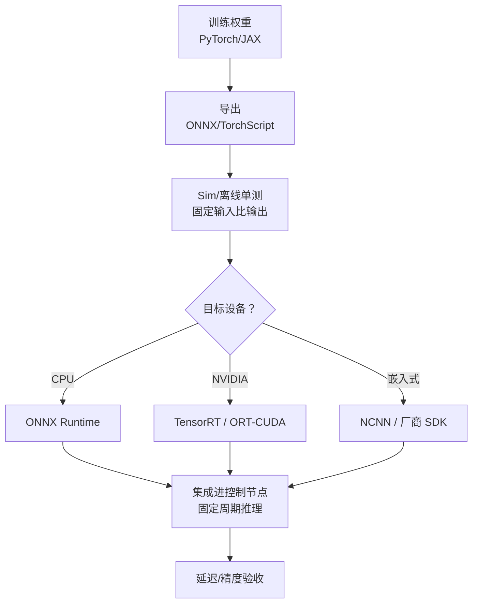

| 检查项 | 说明 |
|--------|------|
| 输入 shape / name | 与 `.info` 或代码常量一致 |
| 归一化 | mean/std 与训练相同 |
| 频率 | 推理耗时 < 控制周期 × 70% |
| 回退 | 推理失败时进入安全模式 |

👉 [edge_deployment](./edge_deployment.md)

---

## 第 10 章：标定与 TF 落地清单

**不重复**坐标变换原理（见 [integration 模式Ⅲ](./robot_system_integration.md#33-模式ⅲ跨坐标系感知-操作)），本篇只列**二次开发必做项**。

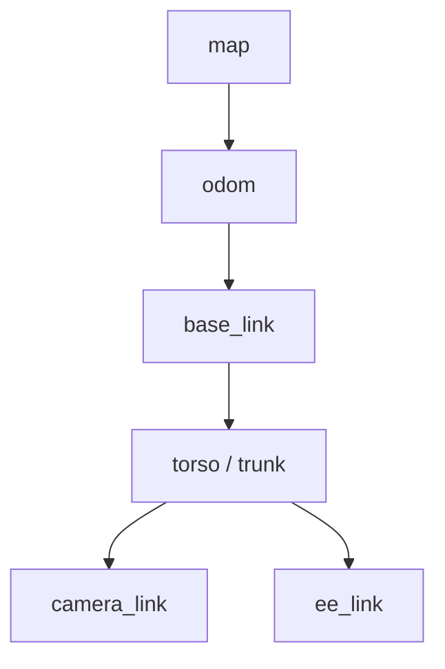

| 标定项 | 方法 | 影响 |
|--------|------|------|
| 相机内参 | 棋盘格 / 官方工具 | 深度尺度、检测投影 |
| 手眼 | eye-in-hand / eye-to-hand | 抓取系统性偏置 |
| 关节零点 | 官方零位 SOP | RL obs、站立姿态 |
| IMU | 静止偏置 / 六面法 | 估计发散 |
| 激光外参 | URDF 或手动 TF | 导航撞墙 |

**排查顺序**：`tf2_tools view_frames` → 时间戳 → 关节名与 URDF → 再查算法。

👉 [camera_calibration](./camera_calibration.md) · [tf_tree](./tf_tree.md) · 实战：[26 关节标定](https://github.com/651yyds3939/kuavo-dev-notes/blob/master/kuavo_notes/26.joint_calibration.md)

---

## 第 11 章：联调排障与 rosbag 回放

**产出**：能复现问题、定位断点属于哪一层，而不是盲目改参数。

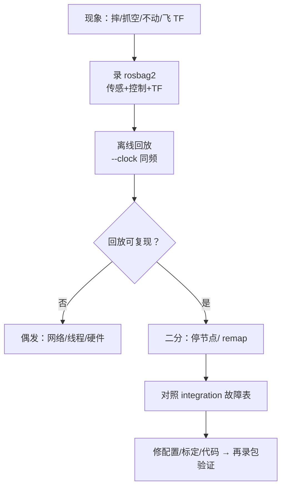

| 现象 | 先查管线层 | integration 模式 |
|------|-----------|------------------|
| 不动 | §3 launch / 使能 / 控制器 | Ⅰ |
| 抓空 | §10 标定 → §6 检测 | Ⅲ |
| 摔机 | §4 obs 对齐 / §9 策略 | Ⅱ |
| 飞 TF | §10 帧链 / 时钟 | Ⅲ |
| 断连乱动 | 网络 + 看门狗 | Ⅱ、Ⅴ |

👉 [integration §八 故障模式](./robot_system_integration.md#八系统集成常见故障模式) · [doc_concept 工作空间](./doc_concept.md)

---

## 附录 A：与思维导图九层的对应

| 软件管线章节 | 思维导图层级 |
|-------------|-------------|
| §1 软件栈 | 全栈 L0–L5 |
| §2–§3 环境/bringup | 九 工程化 |
| §4 Sim2Real | 三 控制 · 九 工程化 |
| §5 导航 | 一 感知 · 二 决策 |
| §6–§7 抓取/VLA | 一 感知 · 二 决策 · 五 应用 |
| §8 数据采集 | 五 应用 · 九 工程化 |
| §9 部署 | 三 控制 · 九 工程化 |
| §10 标定 | 一 感知 · 五 机械(URDF) |
| §11 排障 | 七 通信 · 八 安全 |

---

## 附录 B：与 integration 章节对照

| 本篇（工序） | integration（架构） |
|-------------|---------------------|
| §1.1 双机部署速查 | §3.2 模式Ⅱ |
| §4 Sim2Real 步骤 | §6.3 仿真折叠 |
| §6 抓取工序 | §4.4 + 模式Ⅲ |
| §8 采集工序 | §4.7 + 模式Ⅴ |
| §11 排障 | §八 故障表 |

---

> **备注**：硬件制造见 [lifecycle](../robot_development_lifecycle.md)；模块全貌见 [robot_system.md](../robot_system.md)；**运行时原理**见 [robot_system_integration.md](./robot_system_integration.md)。
