# 机器人系统集成：数据流与控制流如何闭环

> **核心定位**：单看「感知 / 决策 / 控制 / 执行」任一层都不够——系统集成关心的是**谁把什么数据、在什么频率、通过什么中间层交给谁**，以及断一环时系统如何降级。
>
> 👉 全链路索引：[机器人全链路思维导图](../robot_system.md) · 研发全流程：[robot_development_lifecycle.md](../robot_development_lifecycle.md) · 软件管线：[robot_software_pipelines.md](./robot_software_pipelines.md) · 通信机制：[ROS 通信原理](./ros_communication.md)

---

## 一、阅读地图：两层闭环 × 五种集成模式 × 七个经典形态

### 1.1 两条闭环（所有案例共用）

| 闭环 | 周期 | 内容 |
|------|------|------|
| **数据闭环** | 传感 → 估计 → 规划/任务 → 指令 → 执行 → 传感 | 世界状态是否被正确感知并执行 |
| **控制闭环** | 设定值 → 控制器 → 驱动 → 电机 → 编码器/力反馈 | 每个自由度是否跟得上指令 |

**系统集成** = 在统一时钟与坐标系下，把多条数据闭环嵌套进控制闭环，并处理**多速率**（千赫兹力矩环 · 数十赫兹策略/视觉环 · 赫兹级任务环）。

### 1.2 五种集成模式（按「数据怎么流」分类，而非按机型）

| 模式 | 核心特征 | 典型断点 | 对应章节 |
|------|----------|----------|----------|
| **Ⅰ 单机单环** | 感知—规划—控制—执行在同一计算单元 | 规划未接控制器、坐标系未对齐 | [§三.1](#31-模式ⅰ单机单环) |
| **Ⅱ 双机快慢环** | 慢环任务/感知与快环平衡/力矩分机 | 跨机下发力矩、观测不对齐、断连 | [§三.2](#32-模式ⅱ双机快慢环) |
| **Ⅲ 跨坐标系感知-操作** | 视觉/力觉目标经变换链变成关节指令 | 手眼标定、浮动基座、目标过期 | [§三.3](#33-模式ⅲ跨坐标系感知-操作) |
| **Ⅳ 多机协同** | 多平台共享环境表征与任务分配 | 地图不一致、路径冲突、调度延迟 | [§三.4](#34-模式ⅳ多机协同) |
| **Ⅴ 人在回路** | 主端输入—映射—从端执行—反馈回传 | 时延、尺度映射、安全互锁 | [§三.5](#35-模式ⅴ人在回路) |

**横切模块**（不单独构成机型，但每条链路都可能涉及）：[多速率](#51-多速率分层) · [断连降级](#52-断连与降级) · [仿真折叠 / Sim2Real](#53-仿真折叠与-sim2real)

### 1.3 七个经典形态 → 模式映射

| 经典形态 | 主模式 | 常叠加 | 详图 |
|----------|--------|--------|------|
| 轮式自主导航 | Ⅰ | — | [§四.1](#41-轮式自主导航) |
| 固定基座机械臂搬运 | Ⅰ | Ⅲ（有视觉时） | [§四.2](#42-固定基座机械臂搬运) |
| 双足行走与平衡 | Ⅱ | — | [§四.3](#43-双足行走与平衡) |
| 移动操作 / 视觉抓取 | Ⅱ + Ⅲ | Ⅴ（示教采集） | [§四.4](#44-移动操作与视觉抓取) |
| 接触丰富装配 / 插孔 | Ⅲ | Ⅰ 或 Ⅱ | [§四.5](#45-接触丰富装配与插孔) |
| 多车仓储 / 编队 | Ⅳ | Ⅰ（单车环） | [§四.6](#46-多车仓储与编队) |
| 遥操作与示教采集 | Ⅴ | Ⅱ / Ⅲ | [§四.7](#47-遥操作与示教采集) |

> 图中只用**角色与数据类型**；不绑定具体机型、软件包或通信接口名。

---

## 二、抽象总骨架（所有模式的总图）

下面是一张**可实例化**的总骨架：实线为主干，虚线为某模式专用支路。读任一经典形态时，先在此定位「走哪几条边」，再往下看对应模式详图与实例。

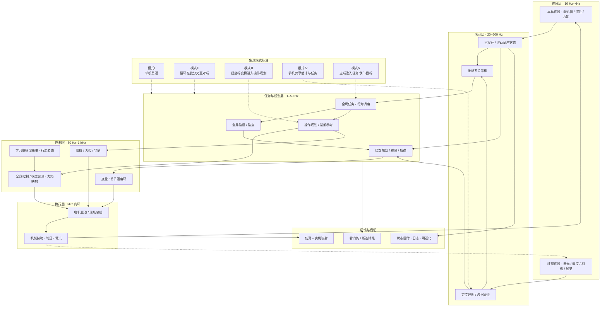
```mermaid
flowchart TB
    subgraph SENSE["传感层 · 10 Hz–kHz"]
        direction TB
        S1["本体传感 · 编码器 / 惯性 / 力矩"]
        S2["环境传感 · 激光 / 深度 / 相机 / 触觉"]
    end

    subgraph EST["估计层 · 20–500 Hz"]
        direction TB
        E1["里程计 / 浮动基座状态"]
        E2["定位建图 / 占据表征"]
        E3["坐标系关系树"]
    end

    S1 --> E1
    S2 --> E2
    E1 --> E3
    E2 --> E3

    subgraph TASK["任务与规划层 · 1–50 Hz"]
        direction TB
        T1["全局任务 / 行为调度"]
        T2["全局路径 / 路点"]
        T3["局部规划 / 避障 / 轨迹"]
        T4["操作规划 / 逆解参考"]
    end

    E3 --> T1
    T1 --> T2
    T1 --> T4
    T2 --> T3
    E1 --> T3
    E2 --> T3

    subgraph CTRL["控制层 · 50 Hz–1 kHz"]
        direction TB
        C1["底盘 / 关节速度环"]
        C2["学习或模型策略 · 行走姿态"]
        C3["全身控制 / 模型预测 · 力矩映射"]
        C4["阻抗 / 力控 / 导纳"]
    end

    T3 --> C1
    T4 --> C3
    T4 --> C4
    C2 --> C3

    subgraph ACT["执行层 · kHz 内环"]
        direction TB
        A1["电机驱动 / 现场总线"]
        A2["机械做功 · 轮足 / 臂爪"]
    end

    C1 --> A1
    C3 --> A1
    C4 --> A1
    A1 --> A2
    A2 --> S1
    A2 -.-> S2

    subgraph MODES["集成模式标注"]
        direction TB
        M1["模式Ⅰ<br/>单机贯通"]
        M2["模式Ⅱ<br/>慢环在此分叉至对端"]
        M3["模式Ⅲ<br/>经坐标变换进入操作规划"]
        M4["模式Ⅳ<br/>多机共享估计与任务"]
        M5["模式Ⅴ<br/>主端注入任务/关节目标"]
    end

    M1 -.-> TASK
    M2 -.-> TASK
    M3 -.-> T4
    M4 -.-> E2
    M5 -.-> T1

    subgraph FEED["反馈与横切"]
        direction TB
        F1["状态回传 · 日志 · 可视化"]
        F2["看门狗 / 断连降级"]
        F3["仿真↔实机映射"]
    end

    E1 --> F1
    TASK --> F2
    ACT --> F3
```

**读图口诀**：

1. 从上到下是**时间尺度由慢到快**，从执行回到传感是**物理闭环**。
2. **模式Ⅰ** 走满一条竖切；**模式Ⅱ** 在任务/规划层拆成上下位；**模式Ⅲ** 在估计层之后插入坐标变换再进操作规划。
3. **模式Ⅳ** 在估计/任务层多机共享；**模式Ⅴ** 在任务层注入人的输入。
4. 底部 **横切** 模块对任何模式都可能生效。

---

## 三、五种集成模式（模式详图）

### 3.1 模式Ⅰ：单机单环

所有计算与通信在同一主机（或实时核）内完成；数据流是**一条链**，适合先建立闭环直觉。

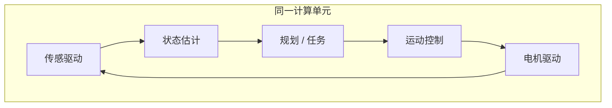
```mermaid
flowchart TB
    subgraph ONE["同一计算单元"]
        O1["传感驱动"] --> O2["状态估计"]
        O2 --> O3["规划 / 任务"]
        O3 --> O4["运动控制"]
        O4 --> O5["电机驱动"]
        O5 --> O1
    end
```

| 环节 | 典型频率 | 数据形态 |
|------|----------|----------|
| 传感 | 10–200 Hz | 原始 + 时间戳 |
| 估计 | 20–100 Hz | 位姿、地图、坐标系 |
| 规划 | 5–20 Hz | 路径、速度指令 |
| 控制 | 50–500 Hz | 轮速 / 关节参考 |
| 驱动 | kHz 内环 | 电流 / 力矩 |

### 3.2 模式Ⅱ：双机快慢环

慢环（任务、视觉、大模型）与快环（平衡、力矩、安全）**分机部署**；机间只传**低维意图与状态**，不传每个力矩周期的高维原始数据。

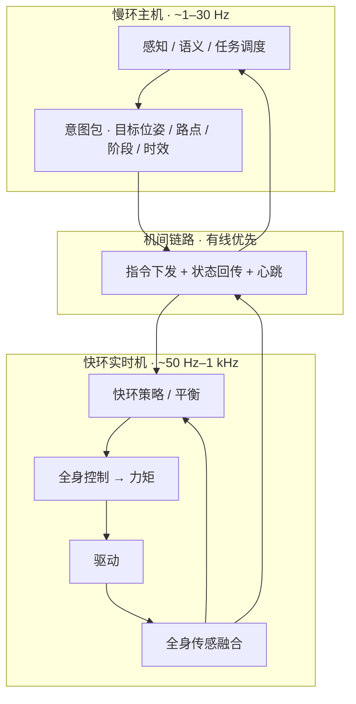
```mermaid
flowchart TB
    subgraph HOST["慢环主机 · ~1–30 Hz"]
        H1["感知 / 语义 / 任务调度"]
        H1 --> H2["意图包 · 目标位姿 / 路点 / 阶段 / 时效"]
    end

    subgraph LINK["机间链路 · 有线优先"]
        L1["指令下发 + 状态回传 + 心跳"]
    end

    subgraph RT["快环实时机 · ~50 Hz–1 kHz"]
        R1["全身传感融合"]
        R1 --> R2["快环策略 / 平衡"]
        R2 --> R3["全身控制 → 力矩"]
        R3 --> R4["驱动"]
        R4 --> R1
    end

    H2 --> L1 --> R2
    R1 --> L1 --> H1
```

### 3.3 模式Ⅲ：跨坐标系感知-操作

操作类集成的本质是：**目标在哪个坐标系表达，经过几次变换才成为关节力矩**。可与模式Ⅰ或Ⅱ叠加。

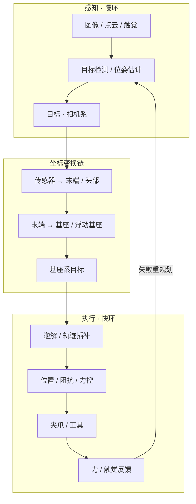
```mermaid
flowchart TB
    subgraph PER["感知 · 慢环"]
        P1["图像 / 点云 / 触觉"]
        P1 --> P2["目标检测 / 位姿估计"]
        P2 --> P3["目标 · 相机系"]
    end

    subgraph TF["坐标变换链"]
        P3 --> T1["传感器 → 末端 / 头部"]
        T1 --> T2["末端 → 基座 / 浮动基座"]
        T2 --> TGT["基座系目标"]
    end

    subgraph EXEC["执行 · 快环"]
        TGT --> X1["逆解 / 轨迹插补"]
        X1 --> X2["位置 / 阻抗 / 力控"]
        X2 --> X3["夹爪 / 工具"]
        X3 --> FB["力 / 触觉反馈"]
        FB -->|失败重规划| P2
    end
```

### 3.4 模式Ⅳ：多机协同

每台机器仍保留**模式Ⅰ 的单机闭环**，额外增加**共享层**：统一或对齐的环境表征、任务分配、冲突消解。

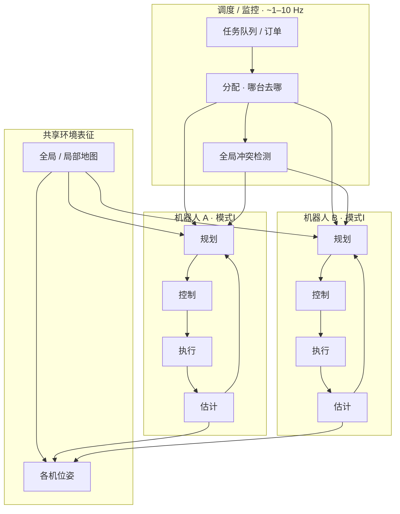
```mermaid
flowchart TB
    subgraph FLEET["调度 / 监控 · ~1–10 Hz"]
        F1["任务队列 / 订单"]
        F1 --> F2["分配 · 哪台去哪"]
        F2 --> F3["全局冲突检测"]
    end

    subgraph MAP["共享环境表征"]
        M1["全局 / 局部地图"]
        M2["各机位姿"]
        M1 --> M2
    end

    subgraph R1["机器人 A · 模式Ⅰ"]
        A1["估计"] --> A2["规划"] --> A3["控制"] --> A4["执行"]
        A4 --> A1
    end

    subgraph R2["机器人 B · 模式Ⅰ"]
        B1["估计"] --> B2["规划"] --> B3["控制"] --> B4["执行"]
        B4 --> B1
    end

    F2 --> A2 & B2
    M1 --> A2 & B2
    A1 & B1 --> M2
    F3 --> A2 & B2
```

### 3.5 模式Ⅴ：人在回路

主端（人）产生连续或离散输入，经**映射与限速**后进入从端控制链；强调**双向反馈**与**安全互锁**，是示教、遥操作、数据采集的常见骨架。

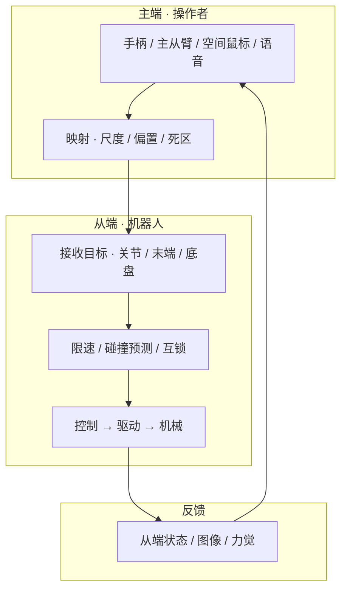
```mermaid
flowchart TB
    subgraph MASTER["主端 · 操作者"]
        M1["手柄 / 主从臂 / 空间鼠标 / 语音"]
        M1 --> M2["映射 · 尺度 / 偏置 / 死区"]
    end

    M2 --> S1

    subgraph SLAVE["从端 · 机器人"]
        S1["接收目标 · 关节 / 末端 / 底盘"]
        S1 --> S2["限速 / 碰撞预测 / 互锁"]
        S2 --> S3["控制 → 驱动 → 机械"]
    end

    S3 --> F1

    subgraph FB2["反馈"]
        F1["从端状态 / 图像 / 力觉"]
    end

    F1 --> M1
```

---

## 四、七个经典形态（实例化 · 映射到总骨架）

各节在总骨架上**高亮一条主路径**；与模式详图重复处从简，只保留该形态特有的分支。

### 4.1 轮式自主导航

**主模式**：Ⅰ · **代表场景**：AGV、扫地机、仓储 AMR 单机调度。

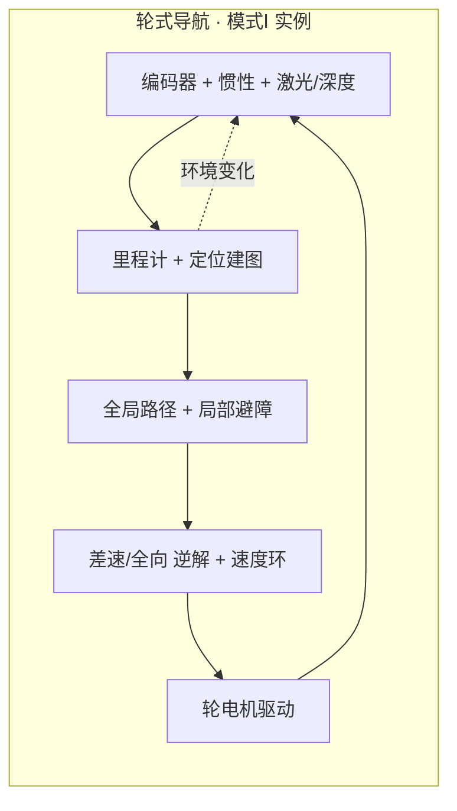
```mermaid
flowchart TB
    subgraph NAV["轮式导航 · 模式Ⅰ 实例"]
        direction TB
        N1["编码器 + 惯性 + 激光/深度"] --> N2["里程计 + 定位建图"]
        N2 --> N3["全局路径 + 局部避障"]
        N3 --> N4["差速/全向 逆解 + 速度环"]
        N4 --> N5["轮电机驱动"]
        N5 --> N1
    end
    N2 -.->|"环境变化"| N1
```

👉 [路径规划](./path_planning.md) · [SLAM](./slam.md) · [状态估计](./state_estimation.md)

### 4.2 固定基座机械臂搬运

**主模式**：Ⅰ（无视觉时）或 Ⅰ+Ⅲ（有视觉时）· **代表场景**：工业 pick-and-place、实验室桌面臂。

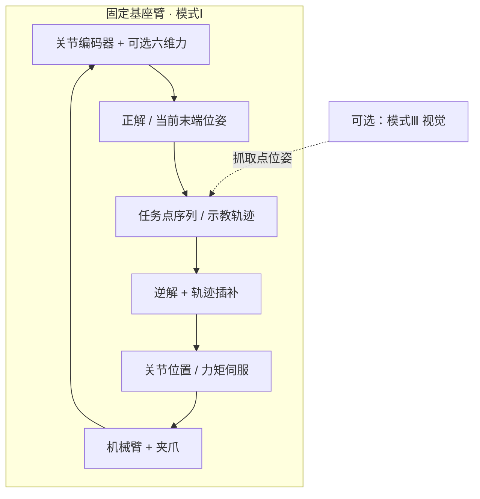
```mermaid
flowchart TB
    subgraph ARM["固定基座臂 · 模式Ⅰ"]
        direction TB
        A1["关节编码器 + 可选六维力"] --> A2["正解 / 当前末端位姿"]
        A2 --> A3["任务点序列 / 示教轨迹"]
        A3 --> A4["逆解 + 轨迹插补"]
        A4 --> A5["关节位置 / 力矩伺服"]
        A5 --> A6["机械臂 + 夹爪"]
        A6 --> A1
    end

    VIS["可选：模式Ⅲ 视觉"] -.->|"抓取点位姿"| A3
```

与轮式导航相比：**无浮动基座**，坐标变换链更短；集成重点在**奇异点、限位、工具中心点标定**。

### 4.3 双足行走与平衡

**主模式**：Ⅱ · **代表场景**：双足人形、双足外骨骼的快环部分。

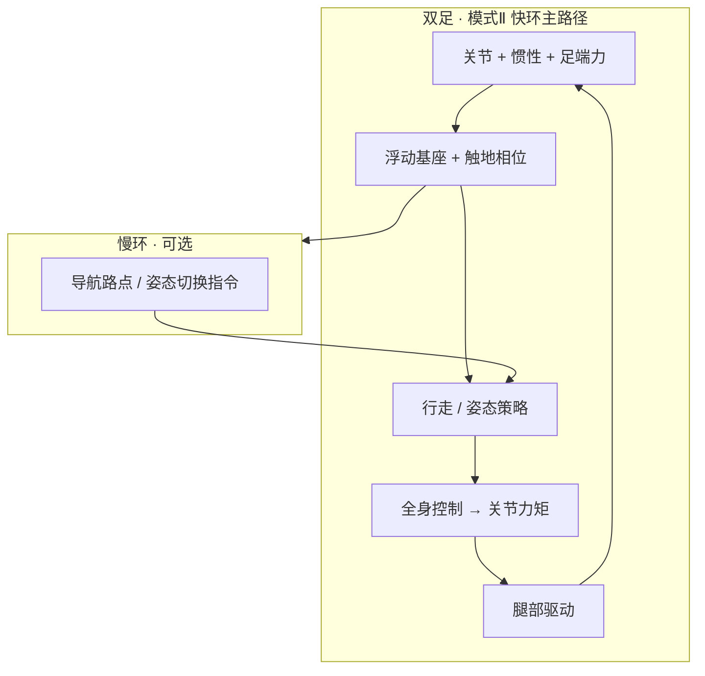
```mermaid
flowchart TB
    subgraph BIP["双足 · 模式Ⅱ 快环主路径"]
        direction TB
        B1["关节 + 惯性 + 足端力"] --> B2["浮动基座 + 触地相位"]
        B2 --> B3["行走 / 姿态策略"]
        B3 --> B4["全身控制 → 关节力矩"]
        B4 --> B5["腿部驱动"]
        B5 --> B1
    end

    subgraph SLOW["慢环 · 可选"]
        S1["导航路点 / 姿态切换指令"]
        S1 --> B3
    end

    B2 --> SLOW
```

**级联原则**：策略给参考，全身控制保物理可行；慢环超时则快环独立保活。详见 [§五.1 跨机目标流](#51-跨机目标流模式ⅱ--ⅲ-合成) 与 [§5.2 断连降级](#52-断连与降级)。

👉 [动力学与控制](./dynamics_control.md) · [强化学习 / Sim2Real](./RL.md)

### 4.4 移动操作与视觉抓取

**主模式**：Ⅱ + Ⅲ · **代表场景**：带臂移动底盘、人形上肢操作、「看到—走到—抓到」。

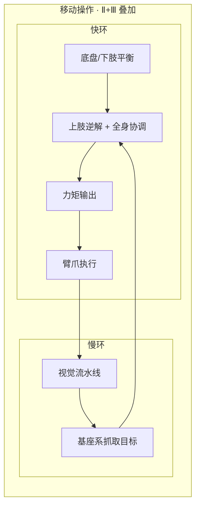
```mermaid
flowchart TB
    subgraph MOB["移动操作 · Ⅱ+Ⅲ 叠加"]
        direction TB
        subgraph UP["慢环"]
            U1["视觉流水线"] --> U2["基座系抓取目标"]
        end
        subgraph DN["快环"]
            D1["底盘/下肢平衡"] 
            U2 --> D2["上肢逆解 + 全身协调"]
            D2 --> D3["力矩输出"]
            D1 --> D2
            D3 --> D4["臂爪执行"]
        end
        D4 --> U1
    end
```

**要点**：视觉在慢环算目标，**不要**每个力矩周期跨机传图；上肢与支撑腿在快环**同一时钟**内协调。

👉 [TF 树](./tf_tree.md) · [机器人建模](./robot_modeling.md)

### 4.5 接触丰富装配与插孔

**主模式**：Ⅲ（力闭环为主）· **常叠加** Ⅰ 或 Ⅱ · **代表场景**： peg-in-hole、插 USB、装配拧紧、擦拭。

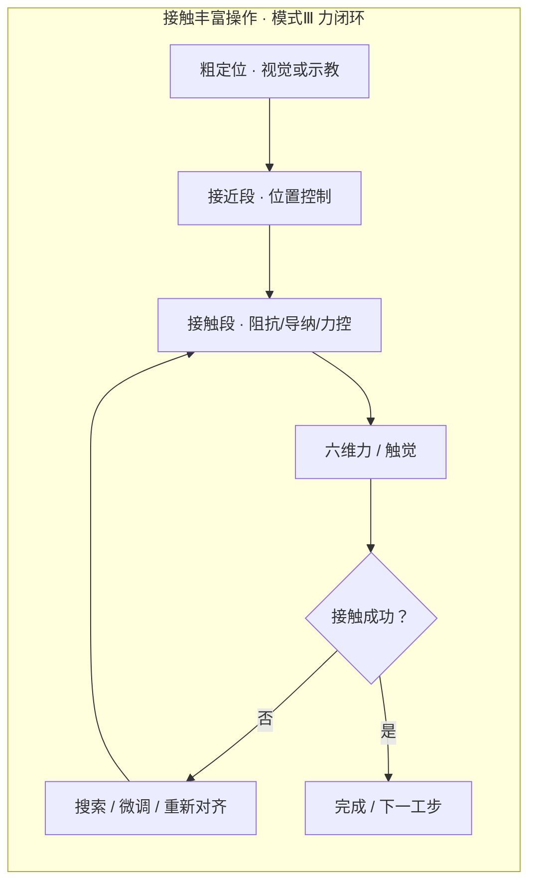
```mermaid
flowchart TB
    subgraph CONT["接触丰富操作 · 模式Ⅲ 力闭环"]
        direction TB
        C1["粗定位 · 视觉或示教"] --> C2["接近段 · 位置控制"]
        C2 --> C3["接触段 · 阻抗/导纳/力控"]
        C3 --> C4["六维力 / 触觉"]
        C4 --> C5{"接触成功？"}
        C5 -->|否| C6["搜索 / 微调 / 重新对齐"]
        C6 --> C3
        C5 -->|是| C7["完成 / 下一工步"]
    end
```

与 [§4.4](#44-移动操作与视觉抓取) 的区别：**闭环变量从位姿误差变为力/阻抗误差**；集成难点在**接触突变、摩擦、延迟**。

👉 [阻抗控制](./impedance_control.md)

### 4.6 多车仓储与编队

**主模式**：Ⅳ · **每台车内部仍为** Ⅰ · **代表场景**：多 AMR 仓库、编队巡航、协同搬运。

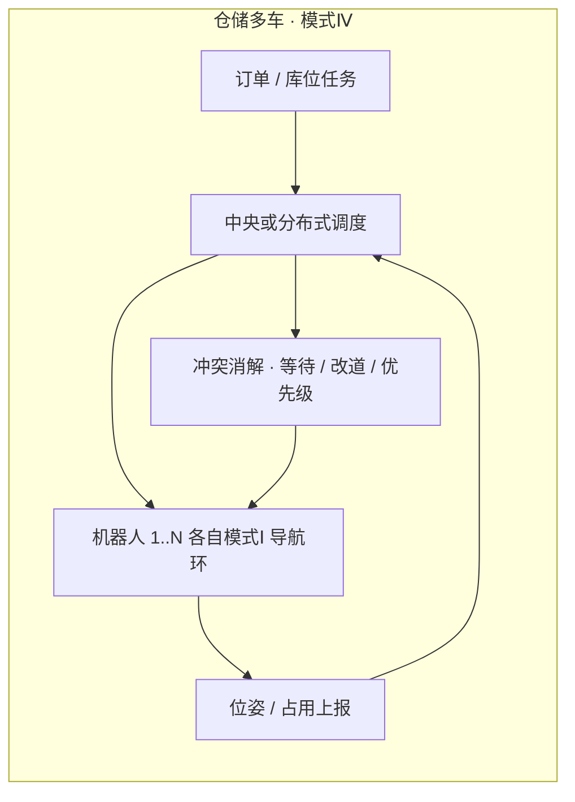
```mermaid
flowchart TB
    subgraph WH["仓储多车 · 模式Ⅳ"]
        direction TB
        W1["订单 / 库位任务"]
        W2["中央或分布式调度"]
        W3["机器人 1..N 各自模式Ⅰ 导航环"]
        W4["位姿 / 占用上报"]
        W5["冲突消解 · 等待 / 改道 / 优先级"]
        W1 --> W2
        W2 --> W3
        W3 --> W4
        W4 --> W2
        W2 --> W5
        W5 --> W3
    end
```

**断点**：地图版本不一致、调度延迟导致路径交叉、通信分区导致「幽灵占用」。

👉 [路径规划](./path_planning.md) · [多机通信](./ros_communication.md)

### 4.7 遥操作与示教采集

**主模式**：Ⅴ · **常叠加** Ⅱ / Ⅲ · **代表场景**：主从臂示教、VR 遥操作、模仿学习数据录制。

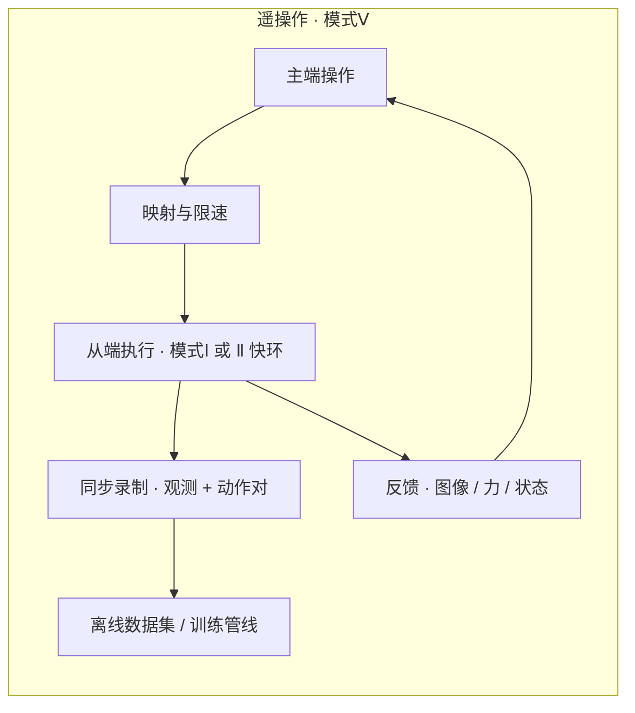
```mermaid
flowchart TB
    subgraph TELE["遥操作 · 模式Ⅴ"]
        direction TB
        T1["主端操作"] --> T2["映射与限速"]
        T2 --> T3["从端执行 · 模式Ⅰ 或 Ⅱ 快环"]
        T3 --> T4["同步录制 · 观测 + 动作对"]
        T3 --> T5["反馈 · 图像 / 力 / 状态"]
        T5 --> T1
        T4 --> T6["离线数据集 / 训练管线"]
    end
```

与 [§4.3](#43-双足行走与平衡) 慢环的区别：**连续实时映射** vs **离散任务意图**；与数据采集**工序**衔接见 [pipelines §8](./robot_software_pipelines.md#第-8-章数据采集与-ilvla-训练管线)。

---

## 五、合成视图（方案 1+2+3 综合）

### 5.1 跨机目标流（模式Ⅱ + Ⅲ 合成）

双机操作、视觉抓取、任务调度共用同一套「**慢环产出目标 → 快环校验执行 → 状态回传**」骨架；此处合并原先分散的跨机图。

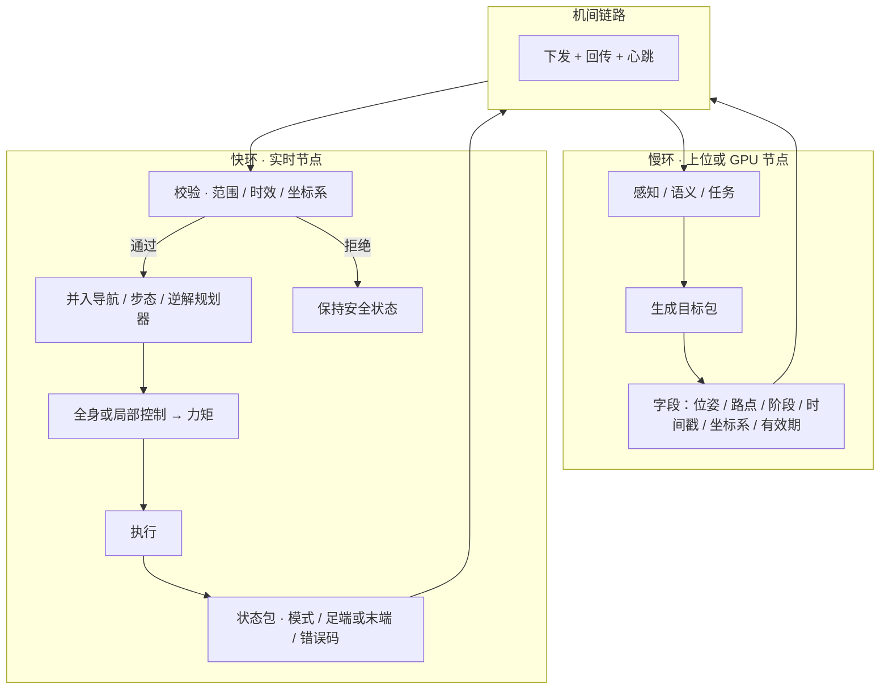
```mermaid
flowchart TB
    subgraph SLOW2["慢环 · 上位或 GPU 节点"]
        direction TB
        S1["感知 / 语义 / 任务"]
        S1 --> S2["生成目标包"]
        S2 --> S3["字段：位姿 / 路点 / 阶段 / 时间戳 / 坐标系 / 有效期"]
    end

    subgraph LINK2["机间链路"]
        L2["下发 + 回传 + 心跳"]
    end

    subgraph FAST2["快环 · 实时节点"]
        direction TB
        F1["校验 · 范围 / 时效 / 坐标系"]
        F1 -->|通过| F2["并入导航 / 步态 / 逆解规划器"]
        F1 -->|拒绝| F3["保持安全状态"]
        F2 --> F4["全身或局部控制 → 力矩"]
        F4 --> F5["执行"]
        F5 --> F6["状态包 · 模式 / 足端或末端 / 错误码"]
    end

    S3 --> LINK2 --> F1
    F6 --> LINK2 --> S1
```

### 5.2 模式叠加：同一机器人上的多模式并存

真实平台常**同时**运行多种模式，而非互斥单选：

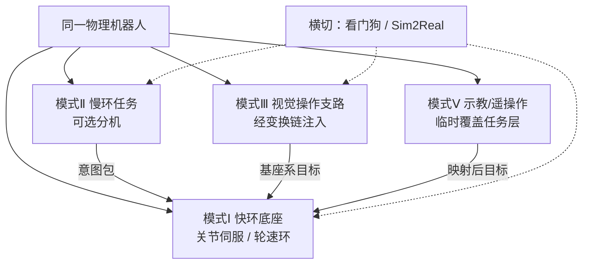
```mermaid
flowchart TB
    ROOT["同一物理机器人"]

    ROOT --> P1["模式Ⅰ 快环底座<br/>关节伺服 / 轮速环"]
    ROOT --> P2["模式Ⅱ 慢环任务<br/>可选分机"]
    ROOT --> P3["模式Ⅲ 视觉操作支路<br/>经变换链注入"]
    ROOT --> P4["模式Ⅴ 示教/遥操作<br/>临时覆盖任务层"]

    P2 -->|"意图包"| P1
    P3 -->|"基座系目标"| P1
    P4 -->|"映射后目标"| P1

    XC["横切：看门狗 / Sim2Real"] -.-> P1 & P2 & P3
```

| 典型组合 | 例子 |
|----------|------|
| Ⅱ + Ⅲ | 人形：下肢 Ⅱ 快环 + 上肢视觉抓取 Ⅲ |
| Ⅰ + Ⅲ | 固定臂：本地 Ⅰ + 相机 Ⅲ |
| Ⅴ + Ⅱ | 遥操作示教，再切回自主慢环 |
| Ⅳ + Ⅰ×N | 仓库多车，每车内部 Ⅰ |

### 5.3 经典形态 × 模式 × 总骨架 对照

| 经典形态 | 总骨架主路径 | 模式 | 横切 |
|----------|--------------|------|------|
| 轮式导航 | 传感→估计→规划→控制→执行 | Ⅰ | Sim2Real |
| 固定臂搬运 | 同上，规划偏逆解 | Ⅰ（+Ⅲ） | — |
| 双足行走 | 快环：估计→策略→全身控制 | Ⅱ | 断连降级 |
| 移动操作 | 慢环 Ⅲ + 快环 Ⅱ | Ⅱ+Ⅲ | 跨机目标流 |
| 接触装配 | 操作规划→力控闭环 | Ⅲ | — |
| 多车仓储 | 共享估计/任务 + 单车 Ⅰ | Ⅳ | 多机时钟 |
| 遥操作采集 | 主端→任务层注入 | Ⅴ | 录制同步 |

---

## 六、横切模块

### 6.1 多速率分层

| 层级 | 典型频率 | 运行位置 | 集成要点 |
|------|----------|----------|----------|
| 任务 / 语义 | ~1 Hz | 慢环主机 | 只输出目标与阶段 |
| 视觉 / 地图 | ~10–30 Hz | 慢环或同机 | 结果需对齐坐标系与时间戳 |
| 策略 / 局部规划 | ~20–50 Hz | 快环或同机 | 观测维度与训练一致 |
| 全身控制 | ~500 Hz–1 kHz | 快环 | 物理约束与力矩映射 |
| 电流 / 力矩内环 | kHz 级 | 驱动层 | 最高优先级 |

**层间接口**：慢→快传递**低维、带时效的目标**；快→慢回传**压缩状态**（模式、错误码、关键标量），避免高频原始数据跨机。

### 6.2 断连与降级

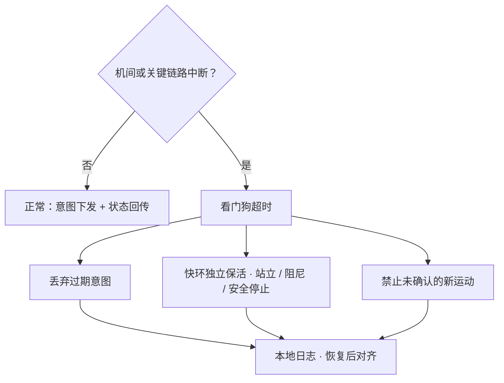
```mermaid
flowchart TB
    Q{"机间或关键链路中断？"}
    Q -->|否| OK["正常：意图下发 + 状态回传"]
    Q -->|是| WD["看门狗超时"]
    WD --> D1["丢弃过期意图"]
    WD --> D2["快环独立保活 · 站立 / 阻尼 / 安全停止"]
    WD --> D3["禁止未确认的新运动"]
    D1 & D2 & D3 --> LOG["本地日志 · 恢复后对齐"]
```

适用于**模式Ⅱ、Ⅳ、Ⅴ**及任何跨进程/跨机集成。

### 6.3 仿真折叠与 Sim2Real

仿真不改变**逻辑骨架**，只折叠「控制→物理→传感」的实现：

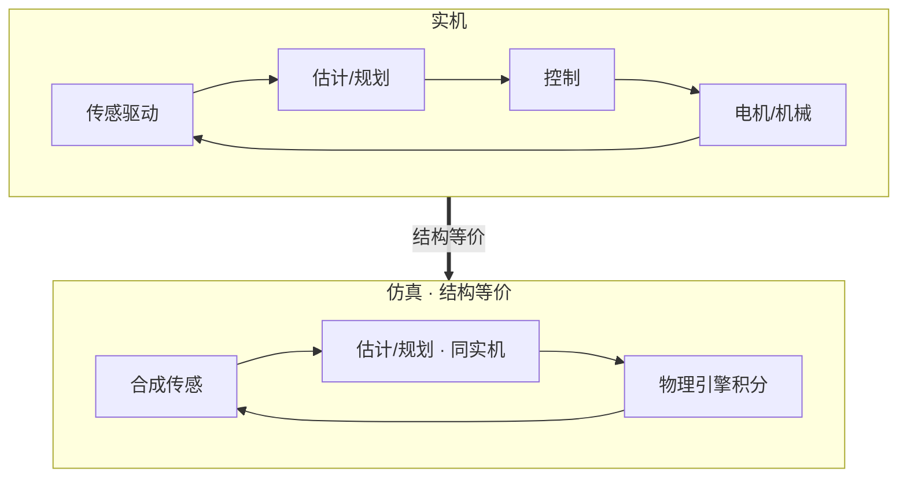
```mermaid
flowchart TB
    subgraph REAL2["实机"]
        RA["传感驱动"] --> RB["估计/规划"]
        RB --> RC["控制"]
        RC --> RD["电机/机械"]
        RD --> RA
    end

    REAL2 ==>|结构等价| SIM2

    subgraph SIM2["仿真 · 结构等价"]
        SA["合成传感"] --> SB["估计/规划 · 同实机"]
        SB --> SC["物理引擎积分"]
        SC --> SA
    end
```

**对齐优先级**：规划以上逻辑尽量同构；**观测统计、延迟、接触动力学**必须单独标定。部署见 [边缘模型部署](./edge_deployment.md) · [RL / Sim2Real](./RL.md)。

---

## 七、数据形态与通道（概念级）

| 数据形态 | 典型方向 | 典型消费者 | 备注 |
|----------|----------|------------|------|
| 原始传感 | 驱动 → 估计 / 日志 | 滤波、策略观测 | 高频、带时间戳 |
| 融合状态 | 估计 → 规划 / 控制 | 定位、平衡、可视化 | 与坐标系树一致 |
| 任务意图 / 目标包 | 慢环 → 快环 | 步态、操作、导航 | 低维、带有效期 |
| 关节参考 / 力矩 | 控制 → 驱动 | 伺服、安全监控 | 最高优先级 |
| 坐标系关系 | 多源广播 | 感知、抓取、导航 | 断链则模型漂移 |
| 多机占用 / 位姿 | 各机 → 调度 | 冲突消解 | 模式Ⅳ 专用 |

通信范式见 [ROS 通信原理](./ros_communication.md)。

---

## 八、系统集成常见故障模式

| 现象 | 可能断点 | 涉及模式 | 排查方向 |
|------|----------|----------|----------|
| 可视化里模型「飞走」 | 坐标系或时间戳 | Ⅰ–Ⅲ | [TF 树](./tf_tree.md)、仿真时钟、时钟同步 |
| 能规划不能动 | 规划未接控制或未使能 | Ⅰ | 启动项、控制器、安全互锁 |
| 策略上实机失稳 | 观测与训练不一致 | Ⅰ、Ⅱ | [URDF](./robot_modeling.md)、关节顺序、输入维度 |
| 抓取系统性偏置 | 变换链错误 | Ⅲ | 手眼标定、浮动基座补偿 |
| 插孔反复顶死 | 力控相位或延迟 | Ⅲ | 阻抗参数、控制频率 |
| 多车路口死锁 | 调度 / 占用不一致 | Ⅳ | 地图版本、优先级策略 |
| 主从遥操作抖动 | 映射或时延 | Ⅴ | 限速、预测显示、缓冲 |
| 上位掉线下位乱动 | 无看门狗 | Ⅱ、Ⅴ | [§6.2](#62-断连与降级) |
| 编译通过运行缺模块 | 环境未加载 | 通用 | [环境笔记](./environment.md) |

---

## 九、从集成视角读工作空间

按**数据流顺序**翻工程，而非按目录名：

1. **启动描述** — 哪些进程在跑？仿真还是实机？对应哪种模式？
2. **参数与 remap** — 数据通道名、控制器增益是否一致。
3. **机器人模型** — 关节名是否与控制、训练配置一致。
4. **驱动与控制器** — 力矩 / 位置接口是否匹配硬件。
5. **算法源码** — 确认数据流无误后再读实现。

文件类型说明：[ROS 工作空间速查](./doc_concept.md)。机型实战案例：[kuavo-dev-notes 仓库](https://github.com/651yyds3939/kuavo-dev-notes)（GitHub 跨库链接）。

---

## 十、与思维导图九层的关系

| 思维导图层级 | 在集成中的角色 | 主要模式 |
|--------------|----------------|----------|
| 感知层 | 数据闭环输入 | Ⅰ–Ⅴ |
| 决策层 | 任务与路径；不直接驱动电机 | Ⅰ、Ⅱ、Ⅳ、Ⅴ |
| 控制层 | 多速率核心 | Ⅰ、Ⅱ、Ⅲ |
| 执行层 | 驱动与机械 | 全部 |
| 通信层 | 机间链路与断连 | Ⅱ、Ⅳ、Ⅴ |
| 安全层 | 急停、互锁、限位 | 横切 |
| 工程化 | 容器、版本、Sim2Real | 横切 |

本篇是「**竖切数据流**」：总骨架（§二）→ 五种模式（§三）→ 七个经典形态（§四）→ 合成与横切（§五–§六）。[思维导图](../robot_system.md) 是「**横切全栈地图**」。建议路径：**总骨架 → 找对应经典形态 → 下钻模式详图 → 查横切与故障表**。
