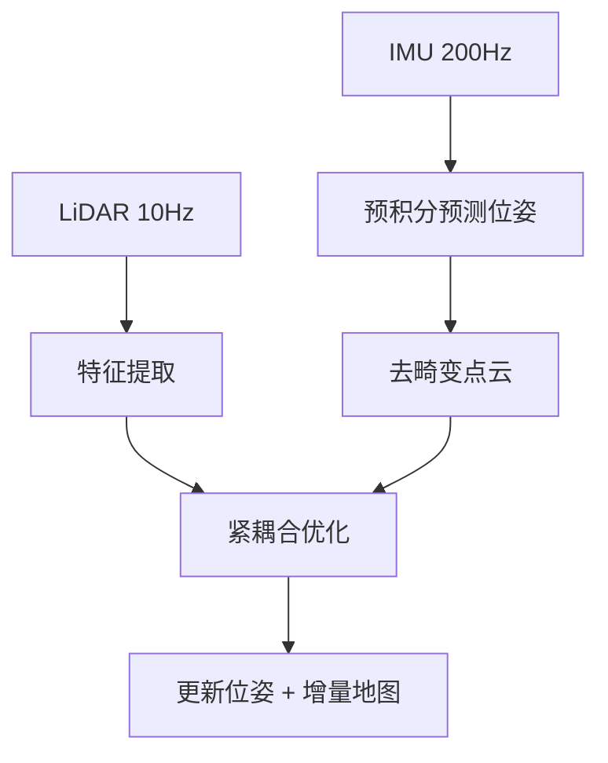
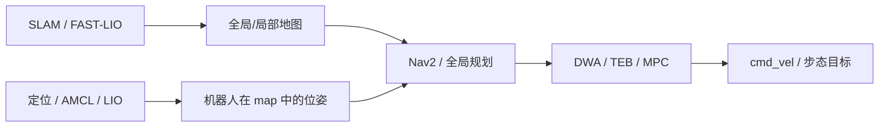

# SLAM 同步定位与建图

> **核心定位**：SLAM（Simultaneous Localization and Mapping）
> 👉 相关：[路径规划](./path_planning.md) · [TF 树](./tf_tree.md) · [状态估计](./state_estimation.md)
>
> SLAM（Simultaneous Localization and Mapping）是机器人**在未知环境中同时估计自身位姿和构建地图**的技术。它是自主导航的基石——不知道自己在哪、不知道周围长什么样，就谈不上路径规划和避障。
>
> 👉 实战笔记：[地图导航与 FAST-LIO 实战](https://github.com/651yyds3939/kuavo-dev-notes/blob/master/kuavo_notes/3.map_navigation.md)

---

## 第 0 章：SLAM 一句话

> **大白话**：SLAM 在移动中同时建图与定位；里程计与观测误差会累积，算法通过融合抑制漂移。

---

## 第 1 章：SLAM 的数学本质

SLAM 是一个**状态估计问题**——同时估计机器人轨迹 $x_{1:T}$ 和地图 $m$，给定传感器观测 $z_{1:T}$ 和控制输入 $u_{1:T}$：

$$p(x_{1:T}, m \mid z_{1:T}, u_{1:T})$$

### 两大类解法

| 方法 | 原理 | 代表算法 |
|------|------|----------|
| **滤波-based** | 递归更新，只保留当前状态估计 | EKF-SLAM, FastSLAM（粒子滤波） |
| **优化-based** | 批量优化所有历史位姿和路标，利用稀疏性加速 | **图优化（Pose Graph）+ 因子图**，g2o / GTSAM / Ceres |

> 现代 SLAM 的主流是**优化-based**——把所有位姿看成图的节点，观测约束看成边，用非线性最小二乘一次性求解全部位姿。

---

## 第 2 章：主流 SLAM 方案

### 2.1 激光 SLAM（LiDAR SLAM）

| 方案 | 特点 | 适用场景 |
|------|------|----------|
| **Cartographer** (Google) | 2D/3D，回环检测强，实时性好 | 室内轮式导航 |
| **FAST-LIO** | 紧耦合 LiDAR-IMU 里程计，计算极快 | 人形/UAV 实时定位 |
| **LOAM / LeGO-LOAM** | 经典激光里程计框架 | 室外大场景 |

### 2.2 视觉 SLAM（V-SLAM）

| 方案 | 特点 |
|------|------|
| **ORB-SLAM3** | 视觉+IMU，支持单目/双目/RGB-D |
| **VINS-Mono/Fusion** | 紧耦合 VIO + GPS 融合 |
| **DSO** | 直接法，不提取特征点 |

### 2.3 关键组件

- **前端（Frontend）**：提取特征/点云配准，计算帧间相对运动
- **后端（Backend）**：图优化 / 因子图，全局一致性优化
- **回环检测（Loop Closure）**：识别"回到了来过的地方"，消除累计漂移
- **重定位（Relocalization）**：丢失后恢复到已知地图

---

## 第 3 章：FAST-LIO —— 实战方案

FAST-LIO 是目前最适合**嵌入式/人形机器人**的激光-IMU 里程计方案：

- **紧耦合**：LiDAR 点云和 IMU 预积分在同一个优化框架中融合
- **ikd-Tree**：增量式 kd-tree，动态插入/删除点云，比传统 kd-tree 快 100 倍
- **计算极轻**：可以在 Orin NX 上实时运行

> 👉 实战排障见：[Docker 挂载 FAST-LIO 踩坑](https://github.com/651yyds3939/kuavo-dev-notes/blob/master/kuavo_notes/3.map_navigation.md)

---

## 关键词速查

| 术语 | 解释 |
|------|------|
| **Pose Graph** | 位姿图：节点=机器人历史位姿，边=位姿间相对约束 |
| **Loop Closure** | 回环检测：识别回到了之前来过的位置，消除漂移 |
| **Factor Graph** | 因子图：比位姿图更通用，可融合多种传感器因子 |
| **ICP** | 迭代最近点：点云配准的基本方法 |
| **VIO** | 视觉-惯性里程计：相机+IMU 紧耦合定位 |
| **Bundle Adjustment** | 光束法平差：同时优化相机位姿和 3D 路标点 |

---

## 第 4 章：SLAM → 导航全栈

SLAM 产出**地图 + 定位**，导航栈消费它们完成路径规划：

| 组件 | 输入 | 输出 |
|------|------|------|
| SLAM 前端 | 传感器原始数据 | 相对运动 |
| SLAM 后端 | 位姿图 | 全局一致地图 |
| 定位 | 地图 + 传感器 | map→odom TF |
| 规划 | 目标点 + 代价地图 | 轨迹 |

👉 详见 [路径规划](./path_planning.md) · [TF 树](./tf_tree.md)

---

## 第 5 章：人形 / 双足 SLAM 注意点

- **运动畸变**：快速摆臂/步态导致 LiDAR 点云畸变更严重，IMU 预积分去畸变更关键
- **浮动基座**：无轮式里程计，**Leg odometry + IMU + LIO** 组合常见
- **地图表示**：2D 栅格适合平面导航；3D OctoMap 适合臂操作避障
- **算力**：FAST-LIO 可在 Orin 实时；V-SLAM 需关注光照与动态物体

---

## 第 6 章：选型速查

| 需求 | 推荐 |
|------|------|
| 室内轮式 | Cartographer + Nav2 |
| 人形实时定位 | FAST-LIO / LIO-SAM |
| 无 LiDAR | VINS-Fusion / ORB-SLAM3 |
| 多机协同 | 共享 Pose Graph + 中心化调度 |
