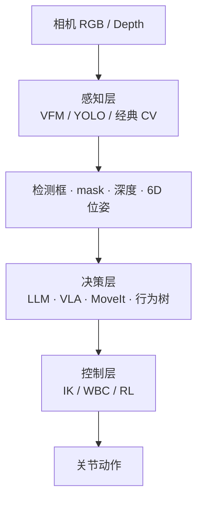

# 视觉基础模型 (Vision Foundation Models)

> **文档定位**：本文为**机器人通用**笔记——流程图与概念不含具体机型、脚本名、IP；**实战落地**见文末 [案例索引](#实战案例索引-kuavo-dev-notes)。
>
> 👉 思维导图：[1.4 高层感知算法](../robot_system.md)
>
> 外部索引：[Embodied-AI-Guide · algorithm.md](https://github.com/TianxingChen/Embodied-AI-Guide/blob/main/topics/algorithm.md#foundation-models)

---

## 第 0 章：一句话理解 VFM

> **大白话**：VFM 是在**超大规模数据**上预训练出来的视觉模型。它们学到的不是「只会认 80 类 COCO 物体」，而是一种**通用的视觉理解能力**——分割、对齐、深度、对应关系等。在机器人里，工程上通常**直接调用别人训好的权重**，而不是从零自己训练。

| 维度 | 传统检测器（YOLO） | 视觉基础模型（VFM） |
|------|-------------------|---------------------|
| 训练数据规模 | COCO 等百万级标注 | 常是十亿级图文 / 自监督 |
| 输出 | 固定类别 bbox / mask | 特征 / 开放词表检测 / 提示分割 / 深度等 |
| 换目标物体 | 改类别过滤，或重新标注微调 | 改文本提示 / 点框提示，Often 零样本 |
| 部署难度 | 低（单模型、单 API） | 中～高（常需多模型 pipeline） |
| 典型延迟 | 实时（30–100+ FPS） | 多数更重（取决于模型大小） |

---

## 第 1 章：VFM 在机器人系统中的位置



**关键结论**：VFM 和 YOLO 都工作在**感知层**，都不直接输出关节角。区别是 YOLO 偏「固定任务、低延迟检测」；VFM 偏「开放世界、语言/提示驱动、更强泛化」。

---

## 第 2 章：概念辨析——YOLO、预训练检测、VFM 不是一回事

### 2.1 YOLO 家族（任务专用检测器）

- **本质**：为**目标检测**（+ 可选分割）设计的网络。
- **典型权重**：COCO 预训练的 `yolov8n.pt` / `yolov8n-seg.pt` 等。
- **用法**：`model(image)` → `boxes`、`scores`、`class_names`。
- **「开箱即用」程度**：⭐⭐⭐⭐⭐。

### 2.2 预训练检测模型 ≠ VFM

**「别人训好的 COCO 通用检测/分割权重 + 业务过滤逻辑」** 属于：

> 直接调用预训练模型，**不需要从零训练**——但仍是 YOLO 路线，类别空间被 COCO 80 类锁死，**不是 VFM**。

例如：过滤 `class_name == 'bottle'` 抓水瓶，是经典工程路线。

### 2.3 Vision Foundation Models

- **本质**：在大规模数据上学**通用视觉表征**，再适配多种下游任务。
- **典型能力**：CLIP（图文对齐）· SAM（提示分割）· Grounding-DINO（开放词表检测）· Depth Anything（单目深度）· FoundationPose（6D 位姿）。
- **「开箱即用」程度**：⭐⭐⭐～⭐⭐⭐⭐（机器人 pipeline 常要组合 2～3 个模型）。

### 2.4 对照表（选型时不混淆）

| 问题 | YOLO + COCO 预训练 | VFM |
|------|-------------------|-----|
| 抓 COCO 里的 `bottle` / `cup` | ✅ 足够，且更快 | 大材小用 |
| LLM 说「抓螺丝刀」且 COCO 无此类 | ❌ 需换类名或微调 | ✅ Grounding-DINO / YOLO-World |
| 只要 bbox，要 30Hz+ | ✅ YOLO 首选 | 通常偏慢 |
| 要精确物体轮廓（mask） | YOLO-seg 可以 | SAM 往往更精细 |
| 只有 RGB、没有深度相机 | 需 Depth Anything 等补深度 | ✅ |
| 中文描述直接驱动检测 | 需「中文→COCO类名」映射 | 文本 prompt 更自然 |

---

## 第 3 章：自己训练 vs 直接调用预训练模型？

> **99% 的机器人视觉项目应优先「调用预训练模型 + 写业务逻辑」；只有预训练搞不定时才考虑微调或自训。**

### 3.1 四条路径（按推荐顺序）

| 路径 | 做什么 | 何时选 | 成本 |
|------|--------|--------|------|
| **A. 零训练推理** | 下载权重，直接 `predict` | 目标在 COCO 80 类内，或 VFM 零样本可用 | 最低 |
| **B. 业务逻辑封装** | 类名过滤、阈值、ROI、TF、IK | 几乎总是需要 | 低 |
| **C. 微调 (Fine-tune)** | 在自有图像上继续训练 | 工厂特定零件、光照极端 | 中 |
| **D. 从零训练** | 自己标注、定义类别 | 极少需要 | 高 |

### 3.2 优先预训练的情况

- COCO 常见类（瓶、杯、人、椅）→ **YOLO COCO 权重 + 过滤**；
- 无 RGB-D → **Depth Anything 预训练**；
- 「文本描述物体」→ **Grounding-DINO / YOLO-World**；
- 精细 mask → **SAM2**（检测框作 prompt）；
- VLA/IL 感知前端 → 多数论文 **冻结或微调** 预训练 backbone。

### 3.3 可能需要微调的情况

- 工业专有零件，COCO/VFM 都认不出；
- 极端域：强反光、透明玻璃、强粉尘；
- 固定工位 + 少量 SKU：标注 500～2000 张，YOLO 微调往往比上大 VFM 更划算。

### 3.4 决策流程图

```
目标物体是什么？
    │
    ├─ 在 COCO 80 类里（bottle/cup/person…）
    │       → YOLO 预训练 + 类名过滤
    │
    ├─ 不在 COCO，但能用语言描述
    │       → Grounding-DINO / YOLO-World + 文本 prompt
    │
    ├─ 需要精细 mask / 遮挡严重
    │       → 检测器 + SAM2 pipeline
    │
    ├─ 只有 RGB、要 3D
    │       → Depth Anything + 点云/IK
    │
    └─ 以上都失败、且有标注预算
            → YOLO 微调 → 仍不行再考虑 VFM 微调
```

---

## 第 4 章：YOLO vs VFM 工程选型

| 环节 | YOLO COCO 路线 | VFM 路线 |
|------|---------------|----------|
| 模型 | COCO 预训练检测/分割权重 | Grounding-DINO / SAM / CLIP 等 |
| 指定目标 | 类名过滤（如 `bottle`） | 文本 prompt / 点框 prompt |
| 3D | RGB-D 深度 + TF | 同上，或单目深度模型补全 |
| LLM 中文指令 | 需中文↔COCO类名映射 | 文本检测更自然 |

**何时从 YOLO 升级到 VFM？**

- LLM 说「抓螺丝刀 / 苹果 / 遥控器」，不想维护类名映射表；
- 透明/反光导致 YOLO+深度不稳定，想试 **SAM mask + 更稳 ROI**；
- 需要 open-vocab，而非固定 80 类。

**最小改动升级路径**：

1. **仍要 YOLO 式 API**：试 **YOLO-World**（文本指定类别）；
2. **要语言 open-vocab**：**Grounding-DINO** 替换检测头，后面 TF→IK 不变；
3. **只要更好 mask**：保留检测框，后接 **SAM2** refine。

---

## 第 5 章：VFM 能力地图（预训练可直接用）

| 类别 | 代表 | 链接 | 是否常自训 |
|------|------|------|-----------|
| 图文对齐 | CLIP · SigLIP | [CLIP](https://github.com/openai/CLIP) | ❌ 直接调用 |
| 表征/跟踪 | DINO v2/v3 | [GitHub](https://github.com/facebookresearch/dino) | ❌ 直接调用 |
| 分割 | SAM / SAM2 | [官网](https://segment-anything.com) | ❌ 直接调用 |
| 开放词表检测 | YOLO-World · Grounding-DINO · OWL-ViT | [Ultralytics](https://docs.ultralytics.com/models/yolo-world/) | ❌ 直接调用 |
| 单目深度 | Depth Anything v2 | [GitHub](https://github.com/LiheYoung/Depth-Anything) | ❌ 直接调用 |
| 6D 位姿 | FoundationPose | [GitHub](https://github.com/NVlabs/FoundationPose) | ❌ 直接调用 |

---

## 第 6 章：典型工程管线

| 任务 | 推荐 pipeline | 训练需求 |
|------|---------------|----------|
| 固定类抓取 | YOLO COCO + 类名过滤 → 深度 → TF → IK | **零训练** |
| 语言指定物体 | Grounding-DINO → 深度 → TF → IK | **零训练** |
| 语言 + 精细 mask | Grounding-DINO → SAM2 → 深度 → IK | **零训练** |
| 无 RGB-D | Depth Anything → 伪点云 → 规划 | **零训练** |
| 工厂独有零件 | 标注 → YOLO **微调** | **仅微调** |

---

## 第 7 章：性能与部署权衡（边缘 GPU 视角）

| 方案 | 相对延迟 | 边缘 GPU 可行性 | 备注 |
|------|----------|----------------|------|
| YOLOv8n | 最快 | ✅ 通常实时 | 固定类首选 |
| YOLOv8n-seg | 快 | ✅ | 带 instance mask |
| YOLO-World | 中 | ✅ 需实测 | API 与 YOLO 接近 |
| Grounding-DINO tiny | 中～慢 | ⚠️ 需实测 | open-vocab |
| SAM2 base | 慢 | ⚠️ 常作 refine | 可与检测框级联 |
| Depth Anything v2 small | 中 | ✅ | 无深度相机时 |

**工程原则**：没有 open-vocab 需求时，**不要为了「更先进」牺牲 YOLO 的稳定性**。

---

## 第 8 章：常见误区

| 误区 | 正解 |
|------|------|
| 「做机器人视觉都要自己训模型」 | 多数项目 **调用预训练 + 业务逻辑** 即可 |
| 「VFM 可以完全替代 YOLO」 | 固定类、高帧率任务，YOLO 往往更合适 |
| 「用了 COCO 预训练 YOLO 就是 VFM」 | VFM 指 CLIP/SAM/Grounding-DINO 等另一生态 |
| 「LLM 传了中文 object_name，检测就是 open-vocab」 | 除非检测节点接文本模型，否则仍靠 **类名过滤** |
| 「检测不准就加大模型」 | 先查 **光照、材质、深度噪点、标定** |

---

## 第 9 章：相关专题

- [VLA 研究版图](./vla_landscape.md) — 感知之后如何到动作
- [LLM for Robotics](./llm_for_robotics.md) — 中文指令如何接到工具链
- [相机标定](./camera_calibration.md) — 手眼标定是抓取前提
- [AI 与机器人学习拓扑](./AI_learning_robotics.md)

---

## 实战案例索引（kuavo-dev-notes）

> 以下为 **[kuavo-dev-notes](https://github.com/651yyds3939/kuavo-dev-notes) 机型实战仓库** 中的落地文档；**通用概念以上文为准**。

| 主题 | 链接 |
|------|------|
| YOLOv8 真机部署（COCO + bottle） | [4.3](https://github.com/651yyds3939/kuavo-dev-notes/blob/master/kuavo_notes/4.3.real_robot_yolo_environment.md) |
| TF2 视觉抓取闭环 | [4.4](https://github.com/651yyds3939/kuavo-dev-notes/blob/master/kuavo_notes/4.4real_visual_grasp.md) |
| VLM 图像触发 | [30](https://github.com/651yyds3939/kuavo-dev-notes/blob/master/kuavo_notes/30.AI_image_identification.md) |
| VLA 抓取全系列 | [22.1–22.4](https://github.com/651yyds3939/kuavo-dev-notes/tree/master/kuavo_notes) |
