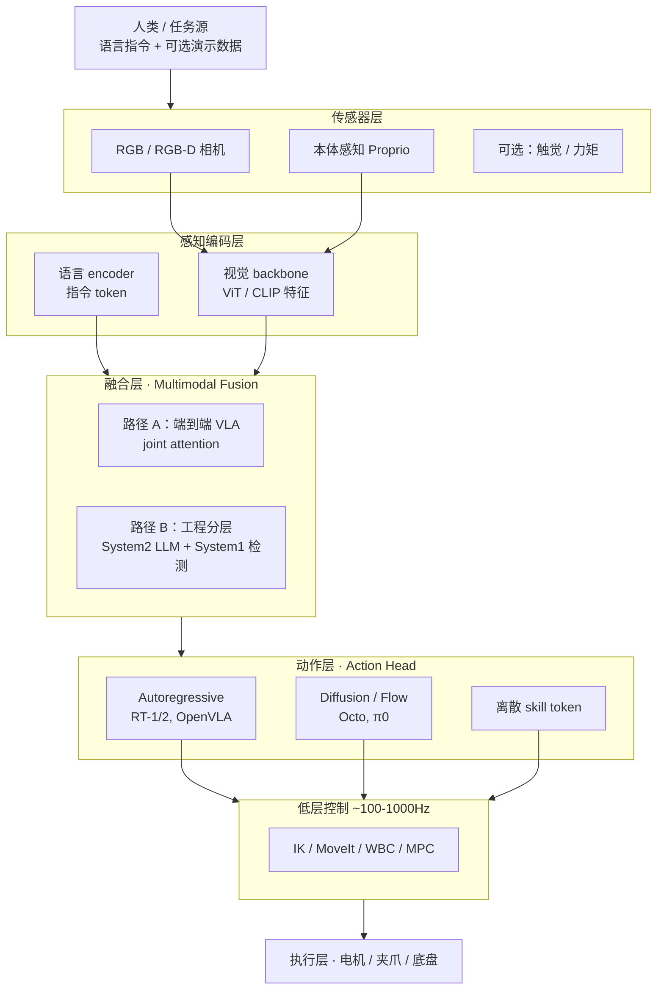

# VLA 研究版图 (Vision-Language-Action Models)

> **文档定位**：本文为**机器人通用**笔记——流程图与概念不含具体机型、脚本名、IP、终端编号；**实战落地**见文末 [案例索引](#实战案例索引-kuavo-dev-notes)。
>
> 👉 思维导图：[2.3.1 具身智能与 VLA](../robot_system.md)
>
> 外部索引：[Embodied-AI-Guide · algorithm.md](https://github.com/TianxingChen/Embodied-AI-Guide/blob/main/topics/algorithm.md#vla) · [Awesome VLA Papers](https://github.com/Psi-Robot/Awesome-VLA-Papers)

---

## 第 0 章：一句话理解 VLA

> **大白话**：给机器人一张图 + 一句「把杯子递给我」，VLA 的输出不是 JSON 计划，而是**可以直接发给电机的动作**（关节角、末端位姿、action chunk 等）。它和「LLM 只负责想、MoveIt 负责做」的分工不同，目标是**视觉-语言-动作在同一套网络里对齐**。

| 对比 | LLM for Robotics | 研究型 VLA（端到端） | 工程分层 VLA |
|------|------------------|---------------------|--------------|
| 输入 | 语言 (+ 可选图像) | 图像 + 语言 | 语音/语言 + 视觉检测 |
| 输出 | 计划 / JSON / Tool Call | 动作 token / 连续 action | 子目标 JSON + 坐标/轨迹 |
| 低层执行 | MoveIt / 状态机 / MCP | 模型内部 action head | IK / 守护进程 / WBC |
| 频率 | ~1Hz | 10–50Hz（目标） | 混合：规划慢、抓取链快 |

---

## 第 1 章：VLA 机器人系统通用架构图

> 适用于理解 OpenVLA、Octo、π0 等**研究型 VLA**，也适用于分析任意具身系统的模块划分。



### 1.1 流程图导读

1. **纵向**：人类指令 → 传感器 → 感知编码 → 融合 → **动作头** → 低层控制 → 电机，与 [全链路思维导图](../robot_system.md) 的「感知→决策→控制→执行」一一对应。
2. **路径 A vs B**：研究 VLA 走 A（单模型）；多数工业落地走 B（分层），**本质仍是 VLA 系统**，只是动作头被拆成 LLM + 检测/IL + IK。
3. **动作层是分水岭**：VLA 论文的创新点多半在「怎么把连续控制量表示成可学习的 token / diffusion 目标」。

---

## 第 2 章：研究型端到端 VLA 数据流

```text
  [ 相机图像 I_t ]  +  [ 语言指令 L ]  +  [ 可选：机器人状态 q_t ]
            \              |                    /
             v            v                  v
         ┌────────────────────────────────────────┐
         │     VLA Backbone (ViT + LLM trunk)       │
         │     OpenVLA-7B / Octo-93M / π0-3.3B      │
         └────────────────────┬───────────────────┘
                              v
         ┌────────────────────────────────────────┐
         │     Action Head (AR / Diffusion / Flow)  │
         └────────────────────┬───────────────────┘
                              v
                    a_t … a_{t+H}  →  low-level PD  →  任务成功率
```

| 场景 | 做法 |
|------|------|
| 复现论文 | 下载 **OpenVLA / Octo / openpi 预训练权重**，在 benchmark 上评测 |
| 换机器人 / 新任务 | **Fine-tune**（LoRA 或全参），需 demo 数据 |
| 从零预训练 VLA | 仅大厂/实验室；一般项目 **不推荐** |

---

## 第 3 章：分层双系统 VLA（2025 产业主流）

```text
  用户：「先把乱了的工具收进抽屉，再把水瓶递给我」
       |
       v
  ┌─────────────────────────────────────────────────────────────┐
  │  System 2 · 慢系统 (~0.5–2 Hz)                               │
  │  VLM / LLM：任务分解 → 子目标序列 / latent plan / 语言子指令   │
  └────────────────────────────┬────────────────────────────────┘
                               │ 子目标：「定位水瓶」→「抓取」→「递给人类」
                               v
  ┌─────────────────────────────────────────────────────────────┐
  │  System 1 · 快系统 (~20–50 Hz)                               │
  │  VLA / IL：ACT · Diffusion Policy · π0 · GR00T-N1 等          │
  └────────────────────────────┬────────────────────────────────┘
                               v
  ┌─────────────────────────────────────────────────────────────┐
  │  经典控制兜底 (~100–1000 Hz)  WBC / IK / 安全限幅              │
  └────────────────────────────┬────────────────────────────────┘
                               v
                         物理机器人
```

**工程对应**：状态机 / 行为树 / MCP Tool Call ≈ System 2；YOLO+IK / ACT / DP ≈ System 1。详见 [LLM for Robotics](./llm_for_robotics.md)。

---

## 第 4 章：工程分层 VLA 架构图（非端到端大模型）

> 研究界 metrics 上这不算「纯 VLA 模型」，但**工程可落地、可调试**，是多数团队的第一条实机路线。

```text
========================================================================================================
              🔧 工程分层 VLA（多机/多进程 · 脑手分离 · 经典控制兜底）
========================================================================================================

  [ 外设 ]  🎤 麦克风   👀 RGB-D 相机   🔊 扬声器
       |              |                      |
       v              v                      v
========================================================================================================
  [ 边缘 AI 节点 / 视觉工控机 ]  GPU：视觉 + 可选本地 LLM
========================================================================================================
       |                              |
  语音/任务主控进程                    视觉感知进程
       |                              |
       |-- VAD / ASR                    |-- 目标检测 / 分割 (YOLO 等)
       |-- LLM 意图解析                 |-- 坐标变换 (TF) → 目标位姿话题
       |-- JSON: {action, target}       |
       |-- TTS 反馈                      |
=======|==============================|================================================
       |        ROS / DDS / HTTP 局域网
=======|==============================|================================================
       v                              v
========================================================================================================
  [ 主控 IPC / 下位机 ]  调度 + 抓取守护 + 发声
========================================================================================================
  TTS 服务                           抓取守护 / 行为树 / MCP 桥
       |                              |-- 订阅意图 + 目标坐标
       v                              |-- 滤波 · 避障 · 轨迹下发
  物理发声                             v
========================================================================================================
  [ 运动控制节点 / 实时主机 ]  WBC / IK / 安全监控
========================================================================================================
  全身平衡 / 逆解 / 关节轨迹跟踪 (100~1000 Hz)
       |
       v
  🤖 机械臂 + 末端执行器

  ┌─ 这在 VLA 谱系里算什么？ ─────────────────────────────────────────┐
  │  System 2：ASR + LLM → JSON / Tool Call（非 RT-2 action token）    │
  │  感知：预训练检测器 / VFM（非 VLM end-to-end）                       │
  │  System 1：IK + 状态机/守护进程（非 Diffusion Policy 端到端）         │
  │  结论：工程可落地；与论文 VLA 共享「视觉-语言-动作闭环」思想           │
  └────────────────────────────────────────────────────────────────────┘
```

### 4.1 System 2 编排形态演进（同一抓取链，三种高层接口）

| 形态 | System 2 | System 1（抓取执行链） |
|------|----------|----------------------|
| **状态机** | LLM → JSON → 硬编码状态机 | 检测+TF → 守护 → IK → WBC |
| **行为树** | LLM → 黑板/话题 → 行为树节点 | 同上 |
| **MCP / Tool Call** | LLM → detect/grasp/speak 工具链 | HTTP/ROS 桥 + 同上 |

**IL 平行路线**：teleop 采 demo → ACT / Diffusion Policy 训 System 1 → 真机部署（语言链可选）。

---

## 第 5 章：VLA 三个关键设计

### 5.1 动作表示

| 方法 | 代表 | 直觉 |
|------|------|------|
| **均匀离散化** | RT-1 | 关节角区间切成 bins → token |
| **FAST tokenizer** | π0 | 压缩动作序列 codec |
| **Diffusion / Flow** | Octo, DP | 直接生成连续 action 向量 |
| **Latent action** | GO-1, UniVLA | System 2 输出 latent，System 1 解码 |

### 5.2 训练数据

| 类型 | 代表 | 特点 |
|------|------|------|
| 跨本体大规模 | Open X-Embodiment | OpenVLA/Octo 基础 |
| 单实验室 | DROID, Bridge | 真实 teleop |
| 仿真合成 | RoboTwin, MimicGen | 规模化、便宜 |
| 自采 teleop | LeRobot / 自研 pipeline | 单本体、任务特化 |

### 5.3 系统形态

| 形态 | 优点 | 缺点 |
|------|------|------|
| **单模型端到端** | 简洁、可 end-to-end fine-tune | 黑盒、难插安全约束 |
| **分层双系统** | 可解释、易工程兜底 | 模块多、接口要对齐 |
| **工程分层** | 可调试、实机验证快 | 论文 novelty 低、泛化靠规则 |

---

## 第 6 章：演进时间线

| 时间 | 工作 | 要点 | 链接 |
|------|------|------|------|
| 2022 | **RT-1** | Transformer 离散 action token | [arXiv](https://arxiv.org/abs/2212.06817) |
| 2023 | **RT-2** | VLM 知识注入 | [arXiv](https://arxiv.org/abs/2307.15818) |
| 2024 | **OpenVLA** | 7B 开源；OXE 数据 | [GitHub](https://github.com/openvla) |
| 2024 | **Octo** | 93M；Diffusion head | [GitHub](https://github.com/octo-models/octo) |
| 2024 | **π0** | Flow + FAST | [openpi](https://github.com/Physical-Intelligence/openpi) |
| 2025 | **GR00T-N1 / GO-1 / π0.5** | 分层双系统 + 全身/移动 | 见 §3 |

---

## 第 7 章：按动作头分类 & IL 基线

| 类型 | 代表 |
|------|------|
| **Autoregressive** | RT-1/2、OpenVLA、RoboFlamingo |
| **Diffusion / Flow** | Octo、π0、RDT-1B、Diffusion Policy |
| **3D 增强** | 3D-VLA、SpatialVLA、DP3 |

**工程 IL 基线**（常作 System 1）：[ACT](https://github.com/tonyzhaozh/act) · [Diffusion Policy](https://github.com/real-stanford/diffusion_policy)

---

## 第 8 章：人形 / 移动相关 VLA

| 工作 | 场景 |
|------|------|
| **NaVILA** | 腿式 + 语言导航 |
| **GR00T-N1** | 全身操作 |
| **Mobility-VLA** | 移动导航 |
| **RDT-1B** | 双臂桌面 |

人形完整 VLA（走+抓+说）尚无统一开源端到端方案；**locomotion 仍多为 RL**，**操作多为 IL/VLA 分层**——与多数工程现状一致。

---

## 第 9 章：自己训练 VLA 还是调用预训练？

| 路径 | 何时选 | 成本 |
|------|--------|------|
| **调用 OpenVLA/Octo/openpi 权重** | 复现 benchmark、同构机械臂 | 低 |
| **Fine-tune（LoRA）** | 自有 teleop 数据、新任务 | 中 |
| **只训 System 1（ACT/DP）** | 抓取闭环；LLM 仍用现成 API/本地模型 | 中；工程最常见 |
| **语言链 + 预训练检测 + IK** | 快速实机验证 | 低；零 VLA 训练 |
| **从零预训练 VLA** | 基本不做 | 极高 |

---

## 第 10 章：常见误区

| 误区 | 正解 |
|------|------|
| 「做了语音抓取就是 VLA 论文」 | 工程 VLA 系统 ≠ 端到端 VLA **模型** |
| 「VLA 要替代 WBC/IK」 | 低层控制几乎总在；VLA 输出多被 IK/WBC 兜底 |
| 「必须上大 VLA 才能抓常见物体」 | COCO 检测 + IK 往往已够；见 [视觉基础模型](./vision_foundation_models.md) |
| 「VLA 和 LLM 机器人二选一」 | 2025 趋势是 **LLM/VLM 做 System 2 + VLA/IL 做 System 1** |

---

## 第 11 章：相关专题

- [LLM for Robotics](./llm_for_robotics.md) — System 2 / MCP / 行为树
- [视觉基础模型](./vision_foundation_models.md) — YOLO vs VFM
- [Benchmark 与 Dataset](./benchmark_dataset.md) — 训练与评测数据
- [AI 与机器人学习拓扑](./AI_learning_robotics.md) — IL / RL / LLM 分工

---

## 实战案例索引（kuavo-dev-notes）

> 以下为 **[kuavo-dev-notes](https://github.com/651yyds3939/kuavo-dev-notes) 机型实战仓库** 中的落地文档，含终端命令、踩坑与源码路径；**通用概念以上文为准**。

| 主题 | 链接 |
|------|------|
| VLA 视听觉全闭环抓取（工程分层 V1） | [22.1](https://github.com/651yyds3939/kuavo-dev-notes/blob/master/kuavo_notes/22.1VLA_grasping.md) |
| 行为树版 VLA | [22.2](https://github.com/651yyds3939/kuavo-dev-notes/blob/master/kuavo_notes/22.2.tree_VLA_grasp.md) |
| MCP Tool Call 抓取 | [22.3](https://github.com/651yyds3939/kuavo-dev-notes/blob/master/kuavo_notes/22.3.MCP_VLA_grasp.md) |
| LeRobot 数据采集 | [22.4](https://github.com/651yyds3939/kuavo-dev-notes/blob/master/kuavo_notes/22.4.Lerobot_grasp.md) |
| 模仿学习环境 | [8](https://github.com/651yyds3939/kuavo-dev-notes/blob/master/kuavo_notes/8.imitation_learning.md) |
| YOLO 真机部署 | [4.3](https://github.com/651yyds3939/kuavo-dev-notes/blob/master/kuavo_notes/4.3.real_robot_yolo_environment.md) |
| TF2 视觉抓取闭环 | [4.4](https://github.com/651yyds3939/kuavo-dev-notes/blob/master/kuavo_notes/4.4real_visual_grasp.md) |
